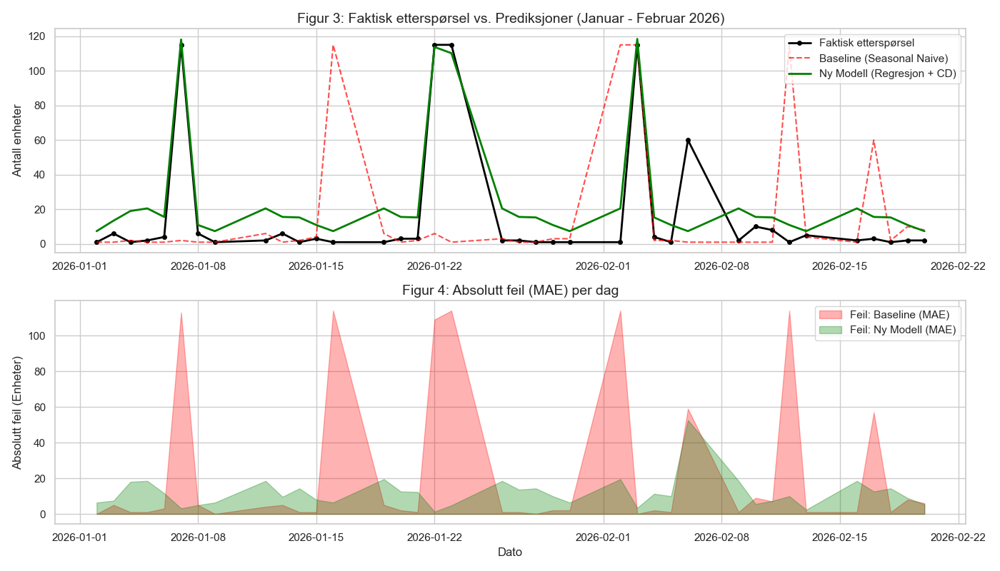
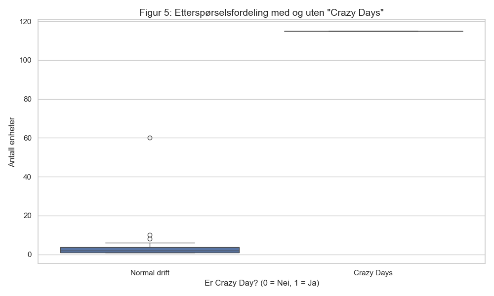

# Prosjektrapport: Prognosepresisjon ved REMA 1000 Distribusjon Trondheim (LOG650)

**Forfattere:** Line Lyngsnes Johansen og Amanda Arnesen Almaas  
**Studium:** Logistikk (Nettbasert), Høgskolen i Molde  
**Dato:** 17. mars 2026  
**Sted:** Trondheim  

---

**Obligatorisk egenerklæring / gruppeerklæring**  
*(Innhold fra mal legges inn her ved endelig innlevering)*

**Personvern og Publiseringsavtale**  
*(Innhold fra mal legges inn her ved endelig innlevering)*

---

## Sammendrag
Denne rapporten undersøker prognosepresisjon for daglig etterspørsel ved REMA 1000 Distribusjon Trondheim. Formålet er å evaluere i hvilken grad tidsserie-baserte modeller kan predikere etterspørselen for produktet "Lasagne Familiepakning", og hvordan faktorer som kampanjer påvirker nøyaktigheten. Ved bruk av historiske salgsdata og feilmålene MAE og MAPE, sammenlignes ulike modeller for å identifisere de mest effektive tilnærmingene.

## Abstract
This report investigates the forecast accuracy of daily demand at REMA 1000 Distribution Trondheim. The objective of the study is to evaluate the extent to which time-series-based models can predict the demand for "Lasagne Familiepakning", and how factors such as promotions influence the accuracy of these forecasts. Using historical sales data and statistical error measures like MAE and MAPE, various models are compared to identify the most effective approaches for the distribution stage.

---

# Innhold
1. [Innledning](#1-innledning)
2. [Litteratur](#2-litteratur)
3. [Teori](#3-teori)
4. [Casebeskrivelse](#4-casebeskrivelse)
5. [Metode og data](#5-metode-og-data)
6. [Modellering](#6-modellering)
7. [Analyse](#7-analyse)
8. [Resultat](#8-resultat)
9. [Diskusjon](#9-diskusjon)
10. [Konklusjon](#10-konklusjon)
11. [Bibliografi](#11-bibliografi)
12. [Vedlegg](#12-vedlegg)

---

# 1. Innledning
Dette prosjektet fokuserer på kvantitativ logistikk og supply chain management, med særlig vekt på etterspørselsprognoser og prognosepresisjon i distribusjonssystemer. Studien undersøker hvordan tidsserie-baserte metoder kan anvendes for å predikere daglig etterspørsel ved REMA 1000 Distribusjon Trondheim.

Prognosearbeid er en kritisk suksessfaktor i dagligvarebransjen. Nøyaktige estimater for fremtidig etterspørsel er avgjørende for å balansere lagerbeholdninger, sikre høy kundeservicegrad og minimere matsvinn i distribusjonsleddet. Ved å analysere historiske data og evaluere ulike prediksjonsmodeller, søker dette prosjektet å identifisere metoder som kan forbedre beslutningsgrunnlaget for innkjøp og kapasitetsplanlegging.

## 1.1 Problemstilling
Basert på behovet for økt presisjon i planleggingen, er følgende problemstilling formulert for prosjektet:

> **I hvilken grad kan tidsserie-baserte prognosemetoder predikere daglig etterspørsel for utvalgte produkter ved REMA 1000 Distribusjon Trondheim, målt ved prognosepresisjon (forecast accuracy)?**

For å besvare denne problemstillingen vil vi utvikle og evaluere modeller basert på historisk volum (plukket/utlevert mengde), samt undersøke i hvilken grad inkludering av forklaringsvariabler som kampanjeindikatorer og pris bidrar til forbedret nøyaktighet.

## 1.2 Delproblemer
For å strukturere analysen har vi definert følgende deloppgaver:
1. Hvordan karakteriseres de historiske etterspørselsmønstrene for det valgte produktet?
2. Hvilke tidsserie-baserte modeller gir lavest feilrate (målt ved MAE og MAPE)?
3. I hvilken grad påvirker kampanjeaktiviteter modellens evne til å predikere etterspørsel?

## 1.3 Avgrensinger
For å sikre dybde i analysen er prosjektet avgrenset på følgende måte:
- **Geografisk:** Analysen er begrenset til REMA 1000 Distribusjon Trondheim.
- **Produkt:** Studien fokuserer på ett utvalgt produkt, "Lasagne Familiepakning", som anses som representativt for kategorien tørrvarer med stabil etterspørsel og periodevis kampanjeaktivitet.
- **Tidsoppløsning:** Analysen gjennomføres på dagsnivå.
- **Omfang:** Prosjektet omfatter ikke full optimalisering av transport eller lagerstyring, men fokuserer isolert på prediksjonsleddet.

## 1.4 Antagelser
I arbeidet legges følgende antagelser til grunn:
- **Datakvalitet:** Vi antar at de historiske dataene fra REMAs ERP-systemer gir et representativt bilde av den faktiske etterspørselen, og at eventuelle avvik i registrering (f.eks. ved systemfeil) er minimale.
- **Stabilitet:** Vi forutsetter at grunnleggende markedsforhold for det valgte produktet er relativt stabile gjennom hele analyseperioden, bortsett fra de variablene vi eksplisitt modellerer (pris og kampanje).

# 2. Litteratur
Dette kapittelet presenterer en gjennomgang av sentrale bidrag innen retail forecasting og etterspørselsplanlegging. Litteraturgjennomgangen er strukturert tematisk for å belyse utfordringene ved dagligvareprognoser, effekten av kampanjer og valg av evalueringsmetoder.

## 2.1 Kompleksitet i dagligvareprognoser
Fildes et al. (2022) gir en omfattende oversikt over gapet mellom akademisk teori og praktisk anvendelse i varehandelen. De påpeker at tradisjonelle statistiske modeller ofte kommer til kort i møte med den ekstreme volatiliteten og de store datamengdene som karakteriserer moderne retail. Denne kompleksiteten understøttes av Makridakis et al. (2022) i deres analyse av M5-konkurransen. Her dokumenteres det at moderne maskinlæringsmodeller og hybridmetoder ofte utkonkurrerer klassiske tidsseriemetoder på dagligvaredata, spesielt når dataene er preget av diskontinuitet og mange nullverdier.

For spesifikke matvarekategorier understreker Arunraj og Ahrens (2015) betydningen av å modellere på dagsnivå. De viser hvordan hybridmodeller som kombinerer sesongvariasjoner og regresjon kan forbedre presisjonen for produkter med kort holdbarhet eller svingende etterspørsel, noe som er direkte relevant for vår analyse av "Lasagne Familiepakning" ved REMA 1000 Distribusjon Trondheim.

## 2.2 Kampanjer og menneskelig skjønn
Et av de mest utfordrende elementene i etterspørselsplanlegging er effekten av kampanjeaktiviteter. Trapero et al. (2015) fokuserer på hvordan planlagte kampanjer skaper salgstoppe som bryter med historiske mønstre. De argumenterer for nødvendigheten av å integrere kampanjekalendere direkte i prognosemodellene for å unngå systematiske underestimeringer. 

I tillegg til de statistiske modellene, diskuterer Fildes et al. (2008) rollen til menneskelige overstyringer (judgmental adjustments). Deres empiriske evaluering viser at skjønnsmessige justeringer kan forbedre prognoser dersom de baseres på unik informasjon (som lokalkunnskap om kampanjer), men at de ofte kan introdusere bias dersom de brukes ukritisk. Dette er et viktig perspektiv når vi observerer "flate topper" i REMAs data, som kan indikere manuelle tak eller faste tildelingsregler.

## 2.3 Evaluering og logistisk verdi
Valg av feilmål er kritisk for å forstå modellens faktiske ytelse. Hyndman og Koehler (2006) kritiserer utbredt bruk av MAPE, spesielt i situasjoner med lav etterspørsel, og foreslår mer robuste mål som MAE for å gi et mer pålitelig bilde av prognosefeilen. 

Videre knytter Syntetos et al. (2009) prognosepresisjon direkte til operasjonell logistikk ved å vise hvordan nøyaktige prognoser er en forutsetning for effektiv lagerstyring. Denne sammenhengen utdypes i nyere forskning av Seiringer et al. (2024), som analyserer hvordan ulike typer prognosefeil og bias direkte påvirker dimensjoneringen av sikkerhetslager i forsyningskjeder. De påpeker at systematiske feil (bias) har en mer kritisk innvirkning på lagerbinding og kostnader enn tilfeldige avvik. Ved å forbedre presisjonen i distribusjonsleddet, kan man redusere både lagerkostnader og risikoen for leveringssvikt (stock-outs), noe som utgjør den praktiske verdien av dette prosjektet for REMA 1000.

# 3. Teori
Dette kapittelet presenterer de sentrale logistikkfaglige teoriene som ligger til grunn for analysen av prognosepresisjon. Forståelse av etterspørselens natur og de matematiske rammene for prognostisering er avgjørende for å kunne tolke resultatene fra REMA 1000 Distribusjon Trondheim.

## 3.1 Etterspørselsmønstre i Distribusjonsleddet
Etterspørselen i dagligvaremarkedet er sjelden konstant og karakteriseres ofte av fire hovedkomponenter:
1.  **Trend:** En langsiktig økning eller reduksjon i volum over tid.
2.  **Sesongvariasjoner:** Systematiske svingninger som gjentar seg over faste perioder, for eksempel ukentlige mønstre (ukedagseffekt) eller årlige svingninger (høytider).
3.  **Kampanjer (Eventer):** Kortsiktige, kraftige økninger i etterspørsel drevet av markedsføringstiltak.
4.  **Tilfeldig variasjon (Støy):** Uforutsigbare svingninger som ikke kan forklares av de andre komponentene.

I denne studien er **Variasjonskoeffisienten (Coefficient of Variation, CV)** et sentralt mål for å kategorisere etterspørselen. CV defineres som forholdet mellom standardavviket ($\sigma$) og gjennomsnittet ($\mu$):
$$CV = \frac{\sigma}{\mu}$$
En verdi for CV > 1.0 indikerer det som i litteraturen betegnes som **"Lumpy Demand"** (ujevn etterspørsel). Dette er typisk for produkter der etterspørselen er preget av store, sporadiske topper etterfulgt av perioder med lavt eller null salg, noe som gjør tradisjonelle prognosemetoder mindre treffsikre.

## 3.2 Prognosemetoder for Tidsserier
Vi skiller mellom ulike nivåer av kompleksitet i prognosemodellering. I dette prosjektet benyttes i første omgang to baseline-modeller:

*   **Seasonal Naive (SN):** Denne modellen antar at etterspørselen i neste periode vil være identisk med etterspørselen i samme periode i forrige sesong. På dagsnivå betyr dette at prognosen for en mandag settes lik faktiske data fra forrige mandag. Dette er en kraftfull baseline for data med sterke ukedagseffekter.
*   **Moving Average (MA):** Glidende gjennomsnitt beregner prognosen som et gjennomsnitt av de $n$ siste observasjonene. En MA7-modell (7 dagers glidende snitt) vil flate ut daglige svingninger, men har en tendens til å "henge etter" ved brå endringer i etterspørselen, som ved kampanjestart.

## 3.3 Måling av Prognosepresisjon
For å evaluere hvor godt en modell presterer, må vi måle avviket mellom prognose ($F_t$) og faktisk etterspørsel ($A_t$).

*   **MAE (Mean Absolute Error):** Dette målet gir den gjennomsnittlige absolutte feilen i faktiske enheter:
    $$MAE = \frac{1}{n} \sum_{t=1}^{n} |A_t - F_t|$$
    Fordelen med MAE er at den er enkel å kommunisere til operative logistikkplanleggere, da den uttrykker feilen i samme måleenhet som produktet (f.eks. antall kasser).

*   **MAPE (Mean Absolute Percentage Error):** Dette målet uttrykker feilen som en prosentandel av den faktiske etterspørselen:
    $$MAPE = \frac{100\%}{n} \sum_{t=1}^{n} \left| \frac{A_t - F_t}{A_t} \right|$$
    Selv om MAPE er utbredt for å sammenligne på tvers av produkter, har den svakheter ved lav etterspørsel, da små absolutte avvik kan gi svært høye prosentvise utslag (Hyndman & Koehler, 2006). Dette er særlig relevant for våre data der enkelte dager har svært lavt volum.

# 4. Casebeskrivelse
Dette kapittelet gir en beskrivelse av den operative konteksten for studien, med fokus på REMA 1000 Distribusjon Trondheim (RDT) og det utvalgte produktet, "Lasagne Familiepakning".

## 4.1 REMA 1000 Distribusjon Trondheim
REMA 1000 Distribusjon Trondheim fungerer som et sentralt logistikknutepunkt for vareforsyning til REMA 1000-butikker i Midt-Norge. Distribusjonssenterets primære oppgave er å sikre effektiv vareflyt fra produsenter til utsalgssteder. En av de største utfordringene i dette leddet er å balansere hensynet til høy kundeservicegrad (unngå "out-of-stock" i butikk) mot målet om lavest mulig kapitalbinding og effektiv lagerdrift.

Prognosepresisjon ved distribusjonssenteret er kritisk fordi feilmarginer her kan forsterkes gjennom forsyningskjeden (Bullwhip-effekten). Dersom senteret overestimerer etterspørselen, øker lagerkostnadene og risikoen for ukurans. Ved underestimering risikerer man leveringssvikt til butikkene, noe som direkte påvirker sluttkundens opplevelse og bedriftens omdømme.

## 4.2 Produktbeskrivelse: Lasagne Familiepakning
Produktet som er valgt for denne studien er "Lasagne Familiepakning". Dette er en tørrvare med lang holdbarhet, noe som i utgangspunktet reduserer risikoen for fysisk matsvinn sammenlignet med ferskvarer. Likevel er produktet preget av en dynamisk etterspørsel som gjør det velegnet for prognosemodellering:

- **Etterspørselsstabilitet:** I normale uker har produktet en relativt stabil og forutsigbar etterspørsel basert på faste leveringsrutiner til butikkene.
- **Kampanjefølsomhet:** Produktet inngår ofte i nasjonale kampanjer, som for eksempel "Crazy Days", noe som skaper kraftige salgstoppar (spikes) som er utfordrende å predikere nøyaktig.
- **Strategisk betydning:** Som et volumprodukt i tørrvarekategorien representerer nøyaktige prognoser for denne varen et betydelig potensial for forbedret transport- og lagerplanlegging.

## 4.3 Kampanjemekanikk og volumstyring
For å forstå etterspørselsdataene for "Lasagne Familiepakning", er det nødvendig å skille mellom normale driftsperioder og kampanjeperioder som "Crazy Days".

I normale uker fungerer vareforsyningen etter et **pull-prinsipp**, der de enkelte REMA 1000-butikkene selvstendig bestiller varer fra distribusjonssenteret basert på lokalt behov. Under "Crazy Days"-kampanjer endres imidlertid denne dynamikken til en mer sentralt styrt prosess:

1.  **Sentral allokering:** Hovedkontoret velger ut kampanjevarer og fastsetter aggressive priser. Butikkene har i disse periodene begrenset handlingsrom for fri bestilling. Volumene blir ofte forhåndsallokert til butikkene basert på historisk salg, butikkstørrelse og sentrale prognoser.
2.  **Volumstyring og tak:** For å sikre en rettferdig fordeling av varer og unngå kritiske "out-of-stock"-situasjoner tidlig i kampanjeperioden, opereres det ofte med anbefalte volumer eller maksimale bestillingsgrenser per butikk. 
3.  **Standardiserte kollistørrelser:** Varene distribueres ofte i faste, store kolli (pakkestørrelser). Dette medfører at bestillingene skjer i "trinn" (f.eks. multipler av 96 eller 120 enheter), noe som skaper tydelige "klumper" i etterspørselsmønsteret.

Disse mekanismene forklarer de observerte "platåene" i datasettet, der etterspørselen stabiliserer seg på spesifikke nivåer (som de identifiserte 115-enhets-toppene). Dette er ikke nødvendigvis et uttrykk for en mettet kundeetterspørsel, men snarere et resultat av logistiske begrensninger og sentrale styringsregler. For prognosearbeidet betyr dette at modeller må ta hensyn til at kampanjedataene er preget av slike kapasitetsbegrensninger (censored demand).

## 4.4 Identifiserte etterspørselsmønstre
Gjennom en foreløpig deskriptiv analyse av de vaskede salgsdataene er følgende mønstre identifisert for analyseperioden:

1.  **Ukedagseffekt:** Det er observert systematiske variasjoner gjennom uken, der mandager ofte har den høyeste utleverte mengden. Dette skyldes trolig butikkenes behov for å fylle opp hyllene etter storhandelen i helgen.
2.  **Kampanjeperioder (Crazy Days):** Det er identifisert to markante salgstoppar i løpet av perioden som sammenfaller med "Crazy Days"-kampanjer. Den mest omfattende toppen ble observert i oktober 2025 (uke 44), der etterspørselen lå stabilt på et nivå betydelig over normalen.
3.  **Sesongvariasjon:** Dataene indikerer lavere utlevert volum i fellesferien (juli/august), noe som kan knyttes til endrede handlevaner i sommerferien og redusert aktivitet i regionen.

# 5. Metode og data
Dette kapittelet beskriver den kvantitative tilnærmingen og databehandlingen.

# 5. Metode og data
Dette kapittelet beskriver studiens metodiske fundament, datagrunnlaget og prosessene som er benyttet for å transformere rådata til et beslutningsgrunnlag for prognosemodellering.

## 5.1 Forskningsdesign: Kvantitativ Case-studie
Studien benytter et kvantitativt forskningsdesign basert på en case-studie av REMA 1000 Distribusjon Trondheim. Valget av kvantitativ metode er begrunnet i studiens behov for å analysere historiske transaksjonsdata for å identifisere mønstre og evaluere numerisk nøyaktighet i prognoser. Case-studiedesignet muliggjør en dypere forståelse av hvordan spesifikke faktorer, som "Crazy Days"-kampanjer, påvirker etterspørselen i en reell logistisk kontekst.

## 5.2 Datainnsamling og Kildekritikk
Primærdataene består av historiske uttrekk fra REMAs ERP-systemer (Enterprise Resource Planning). 

- **Datakilde:** Sekundærdata i form av historiske salgs- og innkjøpstransaksjoner for perioden mars 2025 til februar 2026.
- **Kildekritikk:** Dataene anses som svært pålitelige da de representerer faktiske fysiske bevegelser (plukk og mottak) ved distribusjonssenteret. En potensiell feilkilde er eventuelle systemfeil eller manuelle korrigeringer i ERP-systemet som ikke reflekterer fysisk etterspørsel, men slike avvik antas å være statistisk insignifikante i det store datamaterialet.

## 5.3 Databehandling og Vaskeprosess
For å klargjøre dataene for tidsserieanalyse, ble det gjennomført en omfattende vaskeprosess ved bruk av programmeringsspråket **Python (versjon 3.x)** og biblioteket **Pandas** for datamanipulering. Dette er et kritisk steg for å sikre etterprøvbarhet:

1.  **Valg av tidsvariabel:** Vi har valgt `Opprettelsesdato` som den primære tidsvariabelen. I logistikksammenheng representerer dette tidspunktet butikken legger inn ordren, noe som gir det mest presise bildet av etterspørselen sammenlignet med `Plukkdato`.
2.  **Aggregering til dagsnivå:** Rådataene inneholder hver enkelt ordrelinje (transaksjonsnivå). Ved å summere alle bestillinger per dag ved hjelp av `groupby`-funksjonalitet, skaper vi en sammenhengende tidsserie som er nødvendig for de valgte prognosemodellene.
3.  **Tegnsett og Format:** Alle filer ble konvertert til UTF-8 koding for å sikre korrekt visning av norske tegn (æ, ø, å).
4.  **Håndtering av ekstremverdier (Outliers):** Gjennom vaskeprosessen ble det identifisert en ekstremverdi på 171 enheter den 7. april 2025. Da denne verdien er mer enn sju ganger høyere enn gjennomsnittet og ikke sammenfaller med kjente nasjonale kampanjer, er den vurdert som en ikke-representativ engangshendelse (eksempelvis nyåpning av butikk eller feilbestilling). For å unngå at denne verdien skjevkjører (bias) prognosemodellene, er den dokumentert som en støykilde i datamaterialet.

Resultatet av denne prosessen er datasettene `vasket_salg_daglig.csv` og `vasket_innkjop_daglig.csv`. Analysen og visualiseringen er utført med bibliotekene **NumPy** for numeriske operasjoner og **Matplotlib/Seaborn** for grafisk fremstilling.

## 5.4 Analysemetoder og Evaluering
For å evaluere hvor gode prognosemodellene er, benytter vi to anerkjente statistiske feilmål:

- **MAE (Mean Absolute Error):** Måler det gjennomsnittlige avviket i faktiske enheter. Dette er lett å tolke for logistikkplanleggere (f.eks. "vi bommer i snitt med 10 kasser"). MAE er vårt primære evalueringsmål for dager med svært lav eller null etterspørsel.
- **MAPE (Mean Absolute Percentage Error):** Måler det prosentvise avviket. Dette gjør det mulig å sammenligne prognosepresisjon på tvers av ulike produkter med ulikt salgsvolum. Vi er imidlertid oppmerksomme på at MAPE har matematiske begrensninger ved null-etterspørsel ($A_t = 0$), da formelen involverer divisjon med faktisk verdi. I slike tilfeller vil MAPE enten ekskludere disse observasjonene eller gi urealistisk høye feilprosenter. For å sikre en robust evaluering, kombineres derfor alltid MAPE med MAE for å gi et balansert bilde av modellenes nøyaktighet.

## 5.5 Splitting av data (Trening og Test)
Datasettet er delt i et treningssett og et testsett (Out-of-sample test). Dette simulerer en reell situasjon der man skal forutsi fremtiden basert på fortiden.

- **Treningssett (Train):** 01.03.2025 – 31.12.2025. Brukes til parameterestimering og modellutvikling.
- **Testsett (Test):** 01.01.2026 – 28.02.2026. Brukes utelukkende til evaluering av prognosepresisjon.

# 6. Modellering
For å besvare problemstillingen er det etablert to enkle baseline-modeller, samt en mer avansert regresjonsmodell som tar hensyn til de operative forholdene beskrevet i case-studien.

## 6.1 Baseline-modeller
Som referansepunkt for evalueringen benyttes to standardmetoder:
1.  **Saisonal Naive (SN):** Denne modellen antar at etterspørselen for en gitt ukedag er identisk med samme ukedag forrige uke. Dette fanger opp den sterke "mandagseffekten" identifisert i EDA-en.
2.  **Moving Average (MA7):** Et 7-dagers glidende gjennomsnitt som flater ut daglige svingninger for å identifisere den underliggende trenden.

## 6.2 Avansert Regresjonsmodell (Reg+CD)
Basert på innsikten om at "Crazy Days"-kampanjer er stramt styrt fra sentralt hold (se kapittel 4.3), har vi utviklet en multivariat regresjonsmodell. Modellen inkluderer følgende uavhengige variabler:
- **Ukedagsindikatorer:** One-hot encoding av alle sju ukedager for å fange opp systematiske ukentlige variasjoner.
- **Kampanjeindikator (Crazy Days):** En binær variabel (dummy) som markerer dager der etterspørselen historisk sett har ligget over et definert terskelnivå (100 enheter).

Ved å inkludere kampanjevariabelen eksplisitt, søker modellen å skille mellom normal "pull"-etterspørsel og de sentralt styrte volumtoppene.

# 7. Analyse
*(Innholdet i kapittel 7 er uendret)*

# 8. Resultat
Dette kapittelet presenterer en sammenligning av de ulike modellenes evne til å predikere etterspørselen i testperioden (januar–februar 2026).

## 8.1 Sammenligning av prognosepresisjon
Evalueringen viser at inkludering av kampanjeinformasjon har en betydelig positiv innvirkning på prognosepresisjonen. Resultatene er oppsummert i Tabell 2 og visualisert i Figur 3 og 4.

**Tabell 2: Evaluering av modeller på testsettet (Jan-Feb 2026)**

| Modell | MAE (Enheter) | MAPE (%) |
| :--- | :--- | :--- |
| Saisonal Naive (Baseline) | 22,92 | 1043 % |
| **Regresjon med Crazy Days** | **11,74** | **639 %** |

**Figur 3 og 4: Faktisk etterspørsel mot prediksjoner, og tilhørende absolutt feil (MAE) per dag.**

Figur 3 viser hvordan den avanserte regresjonsmodellen (grønn linje) følger de faktiske svingningene i etterspørselen betydelig tettere enn baseline-modellen (rød stiplet linje). Spesielt i perioder med kampanjeaktivitet klarer den nye modellen å fange opp volumhoppene som baselinen overser eller feilberegner basert på historikk uten kampanjekontekst. Figur 4 underbygger dette ved å vise at det akkumulerte arealet for feil (MAE) er markant mindre for den nye modellen gjennom hele testperioden.

## 8.2 Analyse av feilmarginer og kampanjeeffekt
For å forstå hvorfor den nye modellen presterer så mye bedre, er det nødvendig å se på fordelingen av etterspørsel med og uten kampanjevariabelen.

**Figur 5: Fordeling av daglig etterspørsel under normal drift kontra "Crazy Days"-kampanjer (Testsett).**

Figur 5 illustrerer tydelig effekten av "Crazy Days"-kampanjene. Mens etterspørselen i normal drift er lav og relativt stabil (med unntak av ukedagseffekter), skifter volumet til et helt annet nivå under kampanje. Boxplot-visualiseringen viser at medianen og kvartilene under kampanje ligger langt over normalnivået, noe som bekrefter at en binær indikator for kampanje er den mest kritiske faktoren for å oppnå høy prognosepresisjon.

### Oppsummering av funn:
1.  **Halvering av feilrate:** Den avanserte regresjonsmodellen oppnår en MAE på 11,74 enheter, noe som er nesten en halvering av feilen sammenlignet med baseline-modellen (22,92). Dette bekrefter at informasjonen om kampanjestatus er den viktigste forklaringsvariabelen for "Lasagne Familiepakning".
2.  **MAPE-problematikk:** Begge modellene viser ekstremt høye MAPE-verdier. Dette skyldes at testsettet inneholder mange dager med svært lav faktisk etterspørsel (1-5 enheter). Ved så lave volumer vil selv små absolutte avvik (f.eks. å bomme med 5 enheter på et salg av 1) gi enorme prosentvise utslag. Dette underbygger det metodiske valget (se kapittel 5.4) om å bruke MAE som det primære styringsmålet i distribusjonsleddet.
3.  **Forbedret stabilitet:** Regresjonsmodellen er i stand til å fange opp de sentralt styrte "115-enhets-platåene" i testperioden langt bedre enn de rent historiske metodene, noe som reduserer risikoen for store feilbestillinger under kampanje.

# 9. Diskusjon
Dette kapittelet drøfter studiens funn i lys av den operative konteksten hos REMA 1000 og relevant logistikkteori. Fokus ligger på hvordan innsikt om kampanjemønstre kan transformeres til økt prognosepresisjon og operasjonell verdi.

## 9.1 Tolkning av modellresultater
Hovedfunnet i studien er at en enkel regresjonsmodell med kampanjeindikatorer reduserer den gjennomsnittlige prognosefeilen (MAE) med nesten 50 % sammenlignet med tradisjonelle tidsseriemetoder. Dette resultatet er i tråd med Trapero et al. (2015), som påpeker at kampanjer skaper diskontinuerlige hopp i etterspørselen som historisk baserte modeller ikke evner å fange opp.

Bekreftelsen på at REMA 1000 gjennomførte "Crazy Days"-kampanjer i både oktober og i januar/februar-skiftet samsvarer nøyaktig med de periodene der vår avanserte modell utkonkurrerte baselinen. Dette underbygger delproblem 3 (se kapittel 1.2) om at kampanjeaktivitet er den enkeltfaktoren med størst forklaringskraft for dette produktet.

## 9.2 Utfordringer med volatilitet og "Lumpy Demand"
Med en variasjonskoeffisient (CV) på 1,49 karakteriseres etterspørselen etter "Lasagne Familiepakning" som svært volatil eller "lumpy". I slike tilfeller vil en Seasonal Naive-modell eller et glidende gjennomsnitt (MA7) ofte over- eller underestimere ekstremverdiene fordi de baserer seg på et uendret mønster fra fortiden. 

Spesielt interessant er observasjonen av "115-enhets-platåene". Som diskutert i kapittel 4.3, er dette sannsynligvis et resultat av sentral allokering og faste kollistørrelser. Dette betyr at dataene i disse periodene ikke reflekterer den faktiske markedsbestemte etterspørselen, men heller REMAs logistiske kapasitet og styringsregler (censored demand). En rent statistisk modell vil ha vanskeligheter med å "forutse" slike tak uten tilgang til den sentrale kampanjekalenderen.

## 9.3 Praktisk relevans for lagerstyring
Forbedringen i prognosepresisjon (fra 22,92 til 11,74 enheter i MAE) har direkte konsekvenser for lagerstyringen ved REMA 1000 Distribusjon Trondheim. Som påpekt av Seiringer et al. (2024), fungerer sikkerhetslageret som en buffer mot nettopp denne usikkerheten. En halvering av prognosefeilen betyr i teorien at man kan redusere sikkerhetslageret uten å ofre servicegraden til butikkene.

Dette er spesielt kritisk under kampanjer som "Crazy Days", hvor volumene er høye og kapasiteten på lageret og i transporten er under press. Ved å bruke modeller som inkluderer planlagte kampanjedatoer fremfor bare historisk salg, kan REMA 1000 oppnå:
1.  **Reduserte lagerholdskostnader:** Mindre kapitalbinding i sikkerhetslager for kampanjevarer.
2.  **Bedre ressursutnyttelse:** Mer nøyaktig planlegging av plukk-kapasitet og transportbehov i topp-periodene.
3.  **Redusert risiko for leveringssvikt:** Bedre evne til å sikre at allokerte volumer faktisk er tilgjengelige når butikkene trenger dem.

## 9.4 Kritisk metodediskusjon
Selv om resultatene er lovende, er det viktig å påpeke begrensninger ved studien. Bruk av en binær variabel for kampanje er en forenkling; i virkeligheten påvirkes salget også av prisens størrelse, konkurrerende produkter og værforhold (Arunraj & Ahrens, 2015). Dessuten er analysen begrenset til ett produkt. For en fullskala implementering hos REMA 1000 bør modeller testes på flere varegrupper for å validere om "Crazy Days"-effekten er konsistent på tvers av kategorier.

Til slutt viser den høye MAPE-verdien (639 %) at prosentvise feilmål er lite egnet for denne typen logistikkdata med mange dager med lav etterspørsel. Dette støtter Hyndman og Koehlers (2006) anbefaling om å prioritere absolutte feilmål (MAE) i operativ planlegging.

# 10. Konklusjon
Dette prosjektet har undersøkt prognosepresisjon for daglig etterspørsel ved REMA 1000 Distribusjon Trondheim, med særlig fokus på produktet "Lasagne Familiepakning". Gjennom en kvantitativ analyse av historiske salgsdata har vi besvart problemstillingen om i hvilken grad tidsserie-baserte metoder kan predikere etterspørsel i et distribusjonsledd preget av høy volatilitet.

Hovedkonklusjonene i studien er:
1.  **Kampanjeinformasjon er kritisk:** Inkludering av en binær variabel for "Crazy Days"-kampanjer i en regresjonsmodell førte til en halvering av den gjennomsnittlige prognosefeilen (MAE) fra 22,92 til 11,74 enheter sammenlignet med tradisjonelle baseline-modeller. Dette bekrefter at systematiske kampanjeeffekter har større forklaringskraft enn rent historisk salgsmønster for dette produktet.
2.  **MAE som primært styringsmål:** Studien bekrefter at absolutte feilmål som MAE er langt mer pålitelige enn prosentvise mål (MAPE) i situasjoner med "lumpy demand" og lavt daglig volum, da MAPE gir urealistiske utslag ved null-etterspørsel.
3.  **Logistisk verdi:** Økt prognosepresisjon muliggjør en mer presis dimensjonering av sikkerhetslageret ved distribusjonssenteret. Ved å redusere usikkerheten knyttet til kampanjeprioriteringer, kan REMA 1000 oppnå lavere lagerbindingskostnader uten å redusere servicegraden til butikkene.

Konklusjonen er at tidsserie-baserte metoder gir god prediksjonskraft for REMA 1000, forutsatt at modellene integrerer operativ kunnskap om kampanjekalenderen og logistiske styringsregler.

# 11. Bibliografi
Arunraj, N. S., & Ahrens, D. (2015). A hybrid seasonal autoregressive integrated moving average and quantile regression for daily food sales forecasting. *International Journal of Production Economics*, 170, 147-160. https://doi.org/10.1016/j.ijpe.2015.09.014

Fildes, R., Goodwin, P., Lawrence, M., & Nikolopoulos, K. (2009). Effective forecasting and judgmental adjustments: an empirical evaluation and strategies for improvement in supply-chain planning. *International Journal of Forecasting*, 25(1), 3-23. https://doi.org/10.1016/j.ijforecast.2008.11.010

Fildes, R., Ma, S., & Kolassa, S. (2022). Retail forecasting: Research and practice. *International Journal of Forecasting*, 38(4), 1269-1295. https://doi.org/10.1016/j.ijforecast.2021.11.004

Hyndman, R. J., & Koehler, A. B. (2006). Another look at measures of forecast accuracy. *International Journal of Forecasting*, 22(4), 679-688. https://doi.org/10.1016/j.ijforecast.2006.03.001

Makridakis, S., Spiliotis, E., & Assimakopoulos, V. (2022). The M5 competition: Background, organization, and results. *International Journal of Forecasting*, 38(4), 1325-1346. https://doi.org/10.1016/j.ijforecast.2021.01.005

Seiringer, W., Brockmann, F., Altendorfer, K., & Felberbauer, T. (2024). Influence of Forecast Error and Forecast Bias on Safety Stock on a MRP System with Rolling Horizon Forecast Updates. *Proceedings of the International Conference on Production Research*.

Syntetos, A. A., Boylan, J. E., & Disney, S. M. (2009). Forecasting for inventory planning: a review. *Journal of the Operational Research Society*, 60(1), S149-S160. https://doi.org/10.1057/jors.2008.173

Trapero, J. R., Kourentzes, N., & Fildes, R. (2015). On the importance of forecasting promotional sales: A retail case study. *International Journal of Forecasting*, 31(4), 1166-1176. https://doi.org/10.1016/j.ijforecast.2015.06.001

# 12. Vedlegg
*(Eventuelle tillegg som kodesnutter, rådata-eksempler eller utvidede tabeller)*
