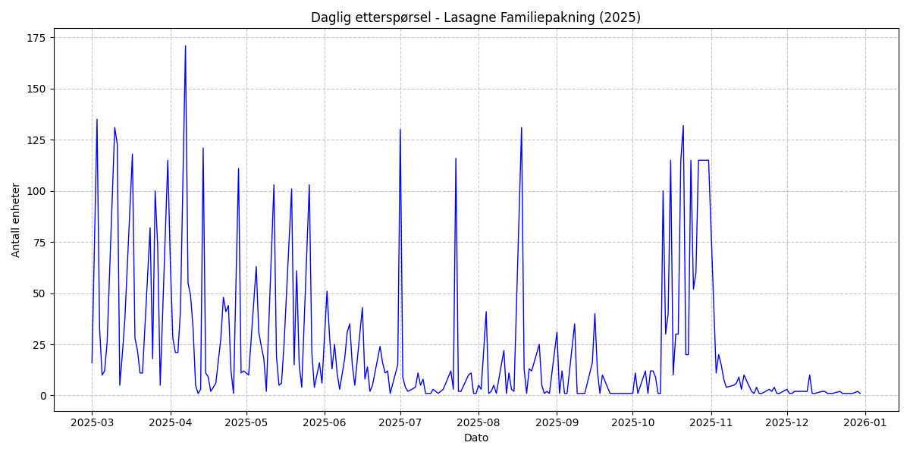
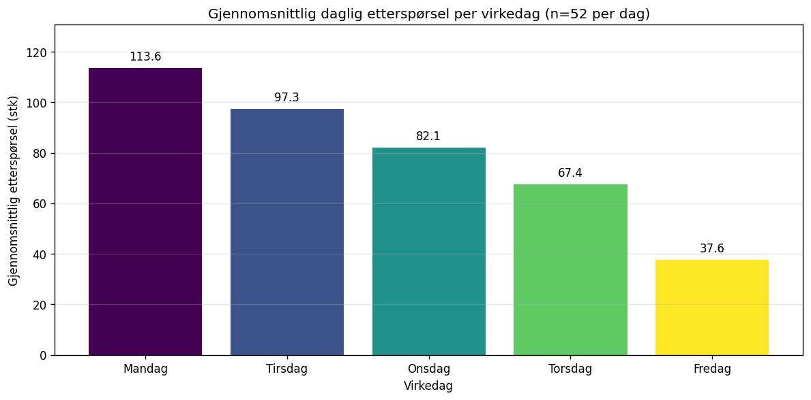
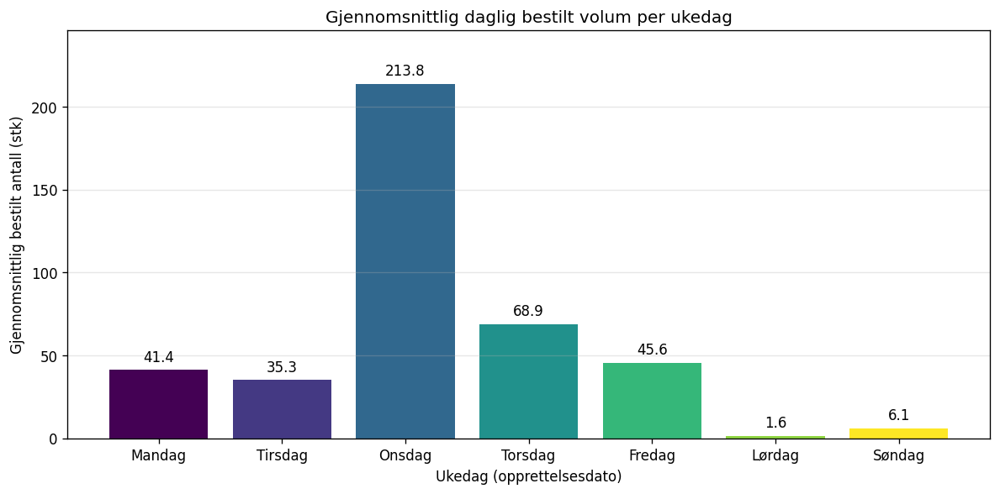
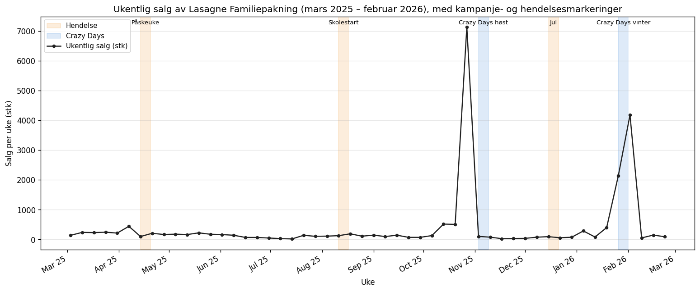
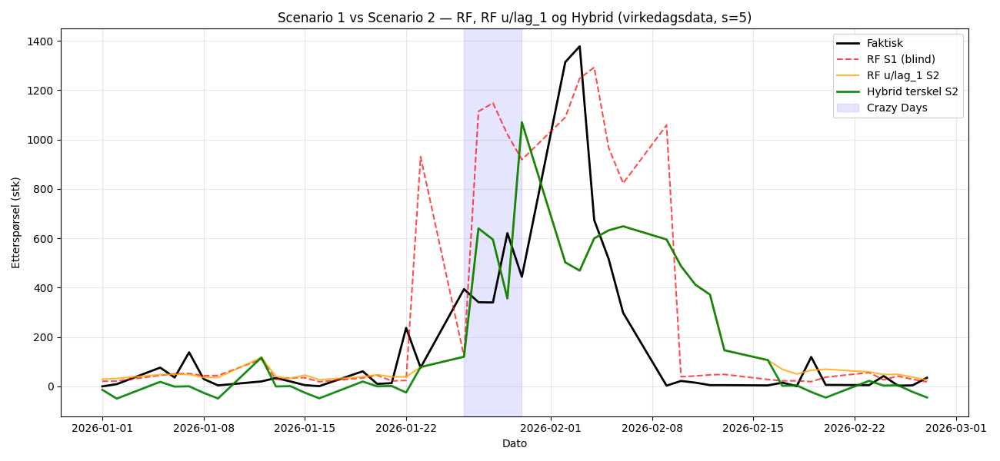
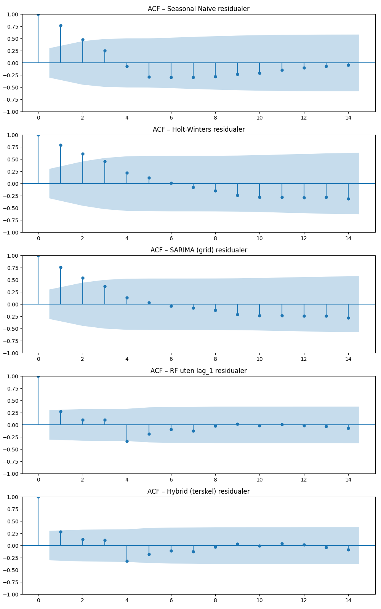
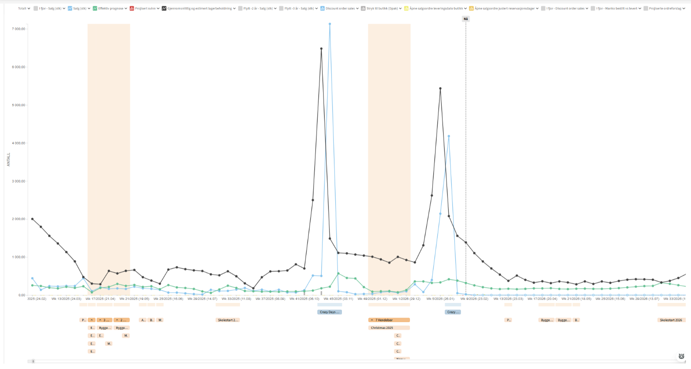

# Prosjektrapport: Prognosepresisjon ved REMA 1000 Distribusjon Trondheim (LOG650)

**Forfattere:** Line Lyngsnes Johansen og Amanda Arnesen Almaas  
**Studium:** Logistikk (Nettbasert), Høgskolen i Molde  
**Dato:** 15. april 2026  
**Sted:** Trondheim  

---

**Obligatorisk egenerklæring / gruppeerklæring**  
*(Innhold fra mal legges inn her ved endelig innlevering)*

**Personvern og Publiseringsavtale**  
*(Innhold fra mal legges inn her ved endelig innlevering)*

---

## Sammendrag
Denne rapporten undersøker prognosepresisjon for daglig etterspørsel ved REMA 1000 Distribusjon Trondheim. Formålet er å evaluere i hvilken grad tidsserie-baserte modeller kan predikere etterspørselen for produktet "Lasagne Familiepakning", og hvordan kampanjeinformasjon påvirker nøyaktigheten. Åtte modeller (Seasonal Naive, Holt-Winters, SARIMA, Random Forest, RF uten lag_1, Gradient Boosting, og to hybridvarianter) er estimert i to scenarier på 260 virkedager (mars 2025 – februar 2026) og evaluert med MAE, MAPE, sMAPE, WAPE og Bias. Analysen viser at SARIMA med grid-søkt parametervalg er mest presis i normaldrift (MAE 29,4 stk), mens Random Forest uten lag_1 presterer best på kampanje- og høytidsdager (MAE 290,2 stk). Binært kampanjeflagg gir marginal global forbedring, noe som peker mot behov for rikere kampanjerepresentasjon. En terskelbasert hybridmodell med balansert bias (+11 stk) anbefales for operasjonelle beslutninger som krever konsistens over tid.

## Abstract
This report investigates the forecast accuracy of daily demand at REMA 1000 Distribution Trondheim for the product "Lasagne Familiepakning". Eight models (Seasonal Naive, Holt-Winters, SARIMA, Random Forest, RF without lag_1, Gradient Boosting, and two hybrid variants) are estimated in two scenarios (with/without campaign information) across 260 business days (March 2025 – February 2026) and evaluated using MAE, MAPE, sMAPE, WAPE, and Bias. Results show that grid-searched SARIMA achieves highest accuracy in routine operations (MAE 29.4 units), while Random Forest without lag_1 performs best on campaign and holiday peaks (MAE 290.2 units). Binary campaign flags yield only marginal global improvements, indicating the need for richer campaign representations. A threshold-based hybrid model with near-zero global bias (+11 units) is recommended for operational decisions requiring consistency over time.

---

# Innhold
1. [Innledning](#1-innledning)
2. [Litteratur](#2-litteratur)
3. [Teori](#3-teori)
4. [Casebeskrivelse](#4-casebeskrivelse)
5. [Metode og data](#5-metode-og-data)
6. [Modellering](#6-modellering)
7. [Analyse](#7-analyse)
8. [Resultat](#8-resultat)
9. [Diskusjon](#9-diskusjon)
10. [Konklusjon](#10-konklusjon)
11. [Bibliografi](#11-bibliografi)
12. [Vedlegg](#12-vedlegg)

---

# 1. Innledning
Dette prosjektet fokuserer på kvantitativ logistikk og supply chain management (forsyningskjedeledelse), med særlig vekt på etterspørselsprognoser og prognosepresisjon i distribusjonssystemer. Studien undersøker hvordan tidsserie-baserte metoder kan anvendes for å predikere daglig etterspørsel ved REMA 1000 Distribusjon Trondheim.

Prognosearbeid er en kritisk suksessfaktor i dagligvarebransjen. Nøyaktige estimater for fremtidig etterspørsel er avgjørende for å balansere lagerbeholdninger, sikre høy kundeservicegrad og minimere matsvinn i distribusjonsleddet. Selv om det utvalgte produktet i denne studien er en tørrvare med lang holdbarhet, har prognosepresisjon her en indirekte, men betydelig innvirkning på det totale svinn-regnskapet. Nøyaktige prognoser for stabile tørrvarekategorier frigjør operativ kapasitet og logistiske ressurser, noe som muliggjør en mer presis og prioritert håndtering av ferskvaredistribusjon – der det faktiske matsvinn-potensialet er største. Ved å analysere historiske data og evaluere ulike prediksjonsmodeller, søker dette prosjektet å identifisere metoder som kan forbedre beslutningsgrunnlaget for den totale vareflyten.

## 1.1 Problemstilling
Basert på behovet for økt presisjon i planleggingen, er følgende problemstilling formulert for prosjektet:

> **I hvilken grad kan tidsserie-baserte prognosemetoder predikere daglig etterspørsel for ett utvalgt produkt ved REMA 1000 Distribusjon Trondheim, målt ved prognosepresisjon (forecast accuracy)?**

For å besvare denne problemstillingen vil vi utvikle og evaluere modeller basert på historisk volum (plukket/utlevert mengde). Selv om inkludering av forklaringsvariabler som kampanjeindikatorer og pris vurderes som teoretisk relevante, er selve analysen i denne oppgaven avgrenset til bruk av historiske salgs- og kalenderdata for å evaluere modellenes grunnleggende prediksjonsevne. En sentral del av studien er å *evaluere* hvordan disse rene tidsseriemodellene presterer i møte med kampanjedrevet etterspørsel, for å kvantifisere behovet for mer avanserte forklaringsvariabler i fremtidige systemer.

Underveis i prosjektarbeidet mottok vi utvidet informasjon om kampanjekalendere og faste markedshendelser fra REMA 1000. Denne informasjonen viste seg å være avgjørende for å forklare de observerte salgstoppene i datasettet. For å kvantifisere verdien av denne tilleggsinformasjonen, har vi valgt å utvide analysen til to scenarioer: Scenario 1, som kun baserer seg på historiske salgsdata (en "blind" tilnærming), og Scenario 2, som integrerer kampanje- og hendelsesinformasjon. Dette gjør det mulig å isolere den faktiske effekten av informasjonsdeling i forsyningskjeden og vurdere hvorvidt avanserte modeller kan kompensere for manglende ekstern informasjon.

## 1.2 Delproblemer
For å strukturere analysen har vi definert følgende deloppgaver:
1. Hvordan karakteriseres de historiske etterspørselsmønstrene for det valgte produktet?
2. Hvilke tidsserie-baserte og maskinlæringsbaserte modeller gir lavest feilrate (målt ved MAE, sMAPE, WAPE og Bias) – totalt og segmentert på normale dager vs toppdager?
3. I hvilken grad bidrar kampanjeinformasjon (Scenario 1 vs Scenario 2) til å forbedre prognosepresisjonen, og hvordan varierer effekten mellom modeller og segmenter?

## 1.3 Avgrensinger
For å sikre dybde i analysen er prosjektet avgrenset på følgende måte:
- **Geografisk:** Analysen er begrenset til REMA 1000 Distribusjon Trondheim.
- **Produkt:** Studien fokuserer på ett utvalgt produkt, "Lasagne Familiepakning", som en tørrvare med stabil basisvolum og periodevis kampanjeaktivitet.
- **Tidsoppløsning:** Analysen gjennomføres på virkedagsnivå (mandag–fredag). Distribusjonssenteret ekspederer ikke i helg.
- **Prisdata:** Prisdata var ønsket i proposalen men er ikke tilgjengelig i datasettet og inngår ikke i analysen.
- **Omfang:** Prosjektet omfatter ikke full optimalisering av transport eller lagerstyring, men fokuserer isolert på prediksjonsleddet.

## 1.4 Antagelser
I arbeidet legges følgende antagelser til grunn:
- **Datakvalitet:** Vi antar at RELEX-eksporten og underliggende ERP-systemer gir et representativt bilde av faktisk utlevert etterspørsel. Ved kryssjekk mot et uavhengig ERP-uttrekk er avviket 0,6 %, som støtter antagelsen (se kap. 4.3).
- **Etterspørsel = utlevert volum:** Fordi distribusjonslageret aldri var utsolgt i perioden (bekreftet av REMA, kap. 4.5), antar vi at observert utlevert volum reflekterer den faktiske etterspørselen – ingen "Censored Demand" (sensurert etterspørsel, dvs. at reell etterspørsel er undertrykt av utsolgt-situasjoner).
- **Stabilitet:** Vi forutsetter at grunnleggende markedsforhold for produktet er relativt stabile gjennom analyseperioden, bortsett fra kampanjer og hendelser som er eksplisitt modellert.
- **Prisdata:** Proposalen nevnte prisdata som ønsket forklaringsvariabel, men dette er ikke tilgjengelig i datasettet og inngår derfor ikke i analysen.

# 2. Litteratur
Dette kapittelet presenterer en gjennomgang av sentrale bidrag innen retail forecasting (dagligvareprognoser) og etterspørselsplanlegging. Litteraturgjennomgangen er strukturert tematisk for å belyse utfordringene ved dagligvareprognoser, effekten av kampanjer og valg av evalueringsmetoder.

## 2.1 Kompleksitet i dagligvareprognoser
Fildes et al. (2022) gir en omfattende oversikt over gapet mellom akademisk teori og praktisk anvendelse i varehandelen. De påpeker at tradisjonelle statistiske modeller ofte kommer til kort i møte med den ekstreme volatiliteten og de store datamengdene som karakteriserer moderne retail. Denne kompleksiteten understøttes av Makridakis et al. (2022) i deres analyse av M5-konkurransen. Her dokumenteres det at moderne maskinlæringsmodeller og hybridmetoder ofte utkonkurrerer klassiske tidsseriemetoder på dagligvaredata, spesielt når dataene er preget av diskontinuitet og mange nullverdier.

For spesifikke matvarekategorier understreker Arunraj og Ahrens (2015) betydningen av å modellere på dagsnivå. De viser hvordan hybridmodeller som kombinerer sesongvariasjoner og regresjon kan forbedre presisjonen for produkter med kort holdbarhet eller svingende etterspørsel, noe som er direkte relevant for vår analyse av "Lasagne Familiepakning" ved REMA 1000 Distribusjon Trondheim.

## 2.2 Kampanjer og menneskelig skjønn
Et av de mest utfordrende elementene i etterspørselsplanlegging er effekten av kampanjeaktiviteter. Trapero et al. (2015) fokuserer på hvordan planlagte kampanjer skaper salgstoppe som bryter med historiske mønstre. De argumenterer for nødvendigheten av å integrere kampanjekalendere direkte i prognosemodellene for å unngå systematiske underestimeringer. 

I tillegg til de statistiske modellene, diskuterer Fildes et al. (2008) rollen til menneskelige overstyringer (judgmental adjustments). Deres empiriske evaluering viser at skjønnsmessige justeringer kan forbedre prognoser dersom de baseres på unik informasjon (som lokalkunnskap om kampanjer), men at de ofte kan introdusere bias dersom de brukes ukritisk. Dette er et viktig perspektiv når vi observerer "flate topper" i REMAs data, som kan indikere manuelle tak eller faste tildelingsregler.

## 2.3 Evaluering og logistisk verdi
Valg av feilmål er kritisk for å forstå modellens faktiske ytelse. Hyndman og Koehler (2006) kritiserer utbredt bruk av MAPE, spesielt i situasjoner med lav etterspørsel, og foreslår mer robuste mål som MAE for å gi et mer pålitelig bilde av prognosefeilen. 

Videre knytter Syntetos et al. (2009) prognosepresisjon direkte til operasjonell logistikk ved å vise hvordan nøyaktige prognoser er en forutsetning for effektiv lagerstyring. Denne sammenhengen utdypes i nyere forskning av Seiringer et al. (2024), som analyserer hvordan ulike typer prognosefeil og bias direkte påvirker dimensjoneringen av sikkerhetslager i forsyningskjeder. De påpeker at systematiske feil (bias) har en mer kritisk innvirkning på lagerbinding og kostnader enn tilfeldige avvik. Ved å forbedre presisjonen i distribusjonsleddet, kan man redusere både lagerkostnader og risikoen for leveringssvikt (stock-outs), noe som utgjør den praktiske verdien av dette prosjektet for REMA 1000.

# 3. Teori
Dette kapittelet presenterer de sentrale logistikkfaglige teoriene som ligger til grunn for analysen av prognosepresisjon. Forståelse av etterspørselens natur og de matematiske rammene for prognostisering er avgjørende for å kunne tolke resultatene fra REMA 1000 Distribusjon Trondheim.

## 3.1 Etterspørselsmønstre i Distribusjonsleddet
Etterspørselen i dagligvaremarkedet er sjelden konstant og karakteriseres ofte av fire hovedkomponenter:
1.  **Trend:** En langsiktig økning eller reduksjon i volum over tid.
2.  **Sesongvariasjoner:** Systematiske svingninger som gjentar seg over faste perioder, for eksempel ukentlige mønstre (ukedagseffekt) eller årlige svingninger (høytider).
3.  **Kampanjer (Eventer):** Kortsiktige, kraftige økninger i etterspørsel drevet av markedsføringstiltak.
4.  **Tilfeldig variasjon (Støy):** Uforutsigbare svingninger som ikke kan forklares av de andre komponentene.

I denne studien er **Variasjonskoeffisienten (Coefficient of Variation, CV)** et sentralt mål for å kategorisere etterspørselen. CV defineres som forholdet mellom standardavviket ($\sigma$) og gjennomsnittet ($\mu$):
$$CV = \frac{\sigma}{\mu}$$
En verdi for CV > 1.0 indikerer det som i litteraturen betegnes som **"Lumpy Demand"** (ujevn etterspørsel). Dette er typisk for produkter der etterspørselen er preget av store, sporadiske topper etterfulgt av perioder med lavt eller null salg, noe som gjør tradisjonelle prognosemetoder mindre treffsikre.

## 3.2 Prognosemetoder for tidsserier
Prosjektet benytter tre nivåer av modellkompleksitet:

**Baseline-modeller:**
* **Seasonal Naïve (SN):** Prognosen for neste periode settes lik faktisk verdi i samme sesongledd forrige periode. På virkedagsnivå med $s=5$ betyr dette at prognosen for en mandag settes lik mandag forrige uke. Kraftfull baseline for data med sterke ukedagseffekter.
* **Holt-Winters (ETS):** Eksponensiell utglatning med trend og sesong. Den additive varianten estimerer nivå, trend og sesongkomponent parametrisk og er en standard klassisk baseline.
* **Moving Average (MA):** Glidende gjennomsnitt av de $n$ siste observasjonene. Testet innledningsvis, men forkastet som primærmodell fordi den glatter ut nettopp de toppene som er kritiske for logistikkplanleggingen.

**Statistisk hovedmodell:**
* **SARIMA** (Seasonal Autoregressive Integrated Moving Average): tidsseriemodell som integrerer sesongmessig differensiering, autoregresjon og moving average. Med eksogene regressorer (SARIMAX) kan kampanje-/hendelsesflagg legges til direkte.

**Maskinlæringsmodeller:**
* **Random Forest (RF):** Ensemble av beslutningstrær. Fanger ikke-lineære interaksjoner mellom lag-features, kalenderfeatures og kampanjeflagg.
* **Gradient Boosting (GBM):** Sekvensielt trenede beslutningstrær som korrigerer hverandres feil. Ofte presis, men krever mer hyperparameter-tuning (systematisk justering av modellens innstillinger).

## 3.3 Måling av prognosepresisjon
For å evaluere prognosens kvalitet benyttes fem komplementære feilmål, tolket som avviket mellom prognose ($F_t$) og faktisk etterspørsel ($A_t$):

* **MAE (Mean Absolute Error):** Gjennomsnittlig absoluttfeil i faktiske enheter, enkel å kommunisere operativt.
    $$MAE = \frac{1}{n} \sum_{t=1}^{n} |A_t - F_t|$$

* **MAPE (Mean Absolute Percentage Error):** Absoluttfeil som prosent av faktisk verdi. Utbredt, men Hyndman og Koehler (2006) advarer mot bruk ved lav etterspørsel – små nevnere gir ekstreme utslag.
    $$MAPE = \frac{100\%}{n} \sum_{t=1}^{n} \left| \frac{A_t - F_t}{A_t} \right|$$

* **sMAPE (Symmetric MAPE):** Skalainvariant og robust mot lave nevnere. Verdier ligger i intervallet [0, 200 %].
    $$sMAPE = \frac{100\%}{n} \sum_{t=1}^{n} \frac{2|A_t - F_t|}{|A_t| + |F_t|}$$

* **WAPE (Weighted Absolute Percentage Error):** Total absoluttfeil vektet med totalvolum. Egnet for volumprioritert logistikk.
    $$WAPE = 100\% \cdot \frac{\sum_{t=1}^{n} |A_t - F_t|}{\sum_{t=1}^{n} |A_t|}$$

* **Bias (Mean Error):** Gjennomsnittlig signert feil. Positiv = overestimering. Seiringer et al. (2024) påpeker at systematisk bias har større operasjonell konsekvens enn tilfeldig varians.
    $$\text{Bias} = \frac{1}{n} \sum_{t=1}^{n} (F_t - A_t)$$

I rapporteringen brukes alle fem for å gi et nyansert bilde. sMAPE og WAPE supplerer MAPE spesielt på lavt volum, der MAPE alene gir misvisende bilder.

# 4. Casebeskrivelse og datagrunnlag
Dette kapittelet gir en forståelse av den operative konteksten og datagrunnlaget som danner fundamentet for analysen. Formålet er å beskrive beslutningssituasjonen ved REMA 1000 Distribusjon Trondheim og karakterisere etterspørselsmønstrene før selve modelleringen starter.

## 4.1 REMA 1000 Distribusjon Trondheim og beslutningssituasjonen
REMA 1000 Distribusjon Trondheim (RDT) fungerer som det sentrale logistikknutepunktet for vareforsyning til butikker i Midt-Norge. Distribusjonssenterets primære oppgave er å sikre effektiv vareflyt fra produsenter til utsalgssteder. Virksomheten er åpen for ekspedisjon fem virkedager i uken (mandag–fredag); helgebestillinger akkumuleres og leveres på påfølgende mandag. Dette forklarer den systematiske mandagseffekten som dokumenteres i kap. 4.4.

### Bestillings- og leveranseprosess
Butikkene legger inn bestillinger via et **automatisk ordreforslagssystem** (AOF, og fra 2026 det nye prognoseverktøyet RELEX). Systemet foreslår ordrekvantum basert på forventet etterspørsel, og butikken godkjenner eller justerer forslaget. Ifølge produkt-kategoriansvarlig (PK, REMA) er det for **tørre og frosne varer praksis at butikkene godkjenner nærmere 100 % av forslagene uten endring**. Dette er særlig relevant for lasagne familiepakning (tørrvare), hvor den operative bestillingskvantiteten derfor i stor grad styres av prognosemodellen. Kvaliteten på prognosen får tilsvarende stor direkte operasjonell betydning.

For **kampanjevarer** kan ordrer i tillegg "pushes" ut til butikkene fra regionskontor eller REMA sentralt, utenom den ordinære AOF-rytmen. RD Trondheim kan selv selge ut overskudd til rabatterte priser ved for stort kvantum eller kort holdbarhet. Lasagne familiepakning er ikke berørt av de siste mekanismene i vesentlig grad.

### Beslutningssituasjoner
Virksomheten står daglig overfor kritiske **beslutningssituasjoner** knyttet til:
1. **Dimensjonering av innkjøp:** Fastsettelse av ordrekvantum fra produsent for å unngå tomme hyller (stock-outs) uten å binde opp for mye kapital i lager.
2. **Kapasitetsplanlegging:** Allokering av transportressurser og personell for plukking og utkjøring.

Uten robuste analyser er disse beslutningene svært vanskelige å ta. Den høye volatiliteten i dagligvaremarkedet gjør at manuelle skjønn ofte fører til systematiske feil (bias). Det er spesielt utfordrende å skille mellom tilfeldig variasjon ("støy") og reelle endringer i etterspørselsnivået før en kampanje inntreffer, noe som skaper et behov for objektive prognosemodeller.

## 4.2 Produktbeskrivelse: Lasagne Familiepakning
Produktet som er valgt for denne studien er "Lasagne Familiepakning" (produktkode 885871, leverandør Orkla Foods Norge). Produktet er en tørrvare med lang holdbarhet, noe som i utgangspunktet reduserer risikoen for fysisk matsvinn. Likevel er produktet preget av en dynamisk etterspørsel – preget av en stabil grunnlinje med kraftige topper under Crazy Days-kampanjer – som gjør det velegnet for denne analysen. Pallestørrelse i RELEX er 115 stk per D-pakning.

## 4.3 Beskrivelse av datagrunnlaget
Datamaterialet er hentet fra REMA 1000s prognoseverktøy RELEX og representerer daglig utlevert volum fra distribusjonssenteret til butikkene.

* **Kilde:** RELEX Solutions-eksport, daglig aggregert per lokasjon og produkt.
* **Datatype:** Tidsseriedata på dagsnivå, forhåndsaggregert til RD Trondheim + Lasagne Familiepakning.
* **Periode:** 1. mars 2025 til 28. februar 2026 (365 kalenderdager).
* **Variabel:** `Salg (stk)` per dag, tolket som utlevert volum.

Distribusjonssenteret ekspederer ikke i helgene, og RELEX rapporterer derfor systematisk null i lør/søn-kolonnene. For modelleringsformål filtrerer vi bort helgedagene og arbeider videre med kun de 260 virkedagene (52 × 5 dager). Dette gir en ren, sammenhengende virkedagssyklus som er kompatibel med sesongmessig modellering med periode s=5 (se kap. 6).

Det finnes 12 helgedager i perioden med registrert salg > 0 (totalt 100 stk, 0,5 % av volumet), fordelt rundt påske, skolestart, jul og nyttår. Disse ekskluderes sammen med de øvrige helgedagene, da inkludering ville bryte virkedagssyklusen og bidra til minimal informasjonsverdi i modellene.

En viktig **datakildekontroll** ble gjennomført underveis: et parallelt ERP-uttrekk på transaksjonsnivå (ordreordrer per butikk) summerer til 20 934 stk for perioden (`Bestilt antall`), mens RELEX sin aggregerte daglige eksport summerer til 20 801 stk. Avviket på 133 stk (0,6 %) lar seg forklare med ulike justeringer mellom bestilt og justert volum (`Justert antall` = 20 697 stk), samt at ERP-uttrekket bruker `Opprettelsesdato` mens RELEX bruker salgs-/leveringsdato. Det lille avviket bekrefter datakildenes konsistens.

Tabell 1 oppsummerer nøkkeltall for virkedagsserien som danner grunnlag for modelleringen.

<div align="center">

*Tabell 1: Beskrivende statistikk for Lasagne Familiepakning (virkedager, mars 2025 – feb 2026)*

| Mål | Verdi (stk) |
| :--- | :--- |
| Antall virkedager (N) | 260 |
| Totalt volum | 20 701 |
| Gjennomsnitt ($\mu$) | 79,6 |
| Median | 20,0 |
| Standardavvik ($\sigma$) | 257,0 |
| **Variasjonskoeffisient (CV)** | **3,23** |
| Minimum | 0 |
| 90. persentil | 91,1 |
| 95. persentil | 300,1 |
| Maksimum (29. okt 2025, pre-Crazy Days) | 2 172 |

</div>

Standardavviket er over tre ganger så stort som gjennomsnittet. CV = 3,23 plasserer etterspørselen klart i kategorien **"Lumpy Demand"** (ujevn etterspørsel, kap. 3.1). Medianen (20 stk) er vesentlig lavere enn gjennomsnittet (79,6), noe som indikerer høyreskjev fordeling – lave verdier preger flertallet av dagene, mens noen få pre-kampanje- og kampanjedager står for en stor andel av det totale volumet.

## 4.4 Etterspørselsmønstre og visualisering
For å få et helhetsbilde av dataenes utvikling over tid, er tidsserien visualisert i Figur 1.

<div align="center">



*Figur 1: Historisk tidsserie (mars 2025 – februar 2026) som viser variasjon i utlevert volum. De to største toppene inntreffer i uken før Crazy Days høst (uke 44/2025) og i uken etter oppstart av Crazy Days vinter (uke 6/2026).*

</div>

Nivået ligger stabilt lavt i normalperioder, men brytes av kortsiktige og kraftige topper rundt kampanjeperiodene. Det er ingen tydelig langsiktig trend, men en klar sesongvariasjon knyttet til ukedager. Dette utdypes i Figur 2.

<div align="center">



*Figur 2: Gjennomsnittlig daglig utlevert volum per virkedag (plukkdato, n = 52 per dag, mars 2025 – februar 2026), som dokumenterer den systematiske mandagseffekten på distribusjonssenteret.*

</div>

Mandager har det desidert høyeste gjennomsnittet (113,6 stk), etterfulgt av tirsdag (97,3), onsdag (82,1), torsdag (67,4) og fredag (37,6). Den fallende profilen gjennom uka skyldes at helgebestillinger akkumuleres og ekspederes på mandag, slik at mandag i praksis rommer tre dagers utleveringsbehov, mens fredagen er lavest fordi butikkene unngår bestillinger de ikke rekker å motta før helgen. Denne systematiske variasjonen er en kritisk innsikt som modellene i kap. 6 må kunne fange opp.

Det er viktig å skille mellom **bestillingsdato** (når butikken oppretter ordren) og **plukkdato/utleveringsdato** (når varene faktisk går ut fra distribusjonssenteret). Figur 2 viser plukkdato; det er denne serien modellene predikerer fordi den bestemmer plukk- og pakkekapasiteten ved DC. Utleveringer skjer så å si utelukkende på virkedager – noen få lørdags- og søndagsutleveringer forekommer gjennom året, typisk i tilknytning til høytider som påske, og er derfor holdt utenfor figuren. Bestillinger registreres derimot hele uka, også lørdag og søndag, og har et helt annet ukedagsmønster. Dette synliggjøres i Figur 3.

<div align="center">



*Figur 3: Gjennomsnittlig daglig bestilt volum per ukedag (opprettelsesdato, alle 7 dager, mars 2025 – februar 2026). Snitt beregnet per kalenderdag i perioden, inkludert dager uten registrerte bestillinger.*

</div>

Onsdag er den klart dominerende bestillingsdagen (213,8 stk), etterfulgt av torsdag (68,9), fredag (45,6), mandag (41,4) og tirsdag (35,3). Lørdag (1,6) og søndag (6,1) er marginale. Onsdagstoppen reflekterer at butikkene legger inn hovedtyngden av ukens ordrer midt i uka – disse plukkes deretter på torsdag/fredag og delvis på mandag påfølgende uke. Bestilling- og utleveringsprofilene er altså faseforskjøvet: bestillingssignalet kommer onsdag, kapasitetsbehovet på DC inntreffer mandag. Totalt bestilt i perioden er 20 934 stk, mot 20 697 stk faktisk utlevert – et avvik på 1,1 % som skyldes justering mellom opprinnelig bestilt og faktisk plukket antall.

## 4.5 Kampanjemekanikk og salgstopper
To Crazy Days-kampanjer er dokumentert av REMA i perioden: uke 45/2025 (3.–9. november) og uke 5/2026 (26. januar–1. februar). Figur 4 viser ukentlig utlevert volum gjennom hele analyseperioden, med kampanje- og hendelsesmarkeringer.

<div align="center">



*Figur 4: Ukentlig utlevert volum for Lasagne Familiepakning (mars 2025 – februar 2026). Blå bokser markerer Crazy Days-kampanjer; oransje bokser markerer hendelser (påske, skolestart, jul).*

</div>

Det mest karakteristiske mønsteret er at **salgstoppen inntreffer i uken før selve kampanjen**, ikke under kampanjen. For Crazy Days høst ligger uke 44 (27.–30. oktober) på 7 131 stk totalt, med dagsverdier 1 082–2 172 stk og maksimum onsdag 29. oktober. Selve kampanjeuken 45 har bare 504 stk. For Crazy Days vinter er bildet todelt: kampanjeuken (uke 5) ligger på 2 140 stk, mens uken etter (uke 6, 2.–6. februar) topper seg på 4 180 stk med dagsverdier opp mot 1 378 stk.

Dette reflekterer logistikken i distribusjonskjeden: butikkene legger inn kampanjeordrer i forkant for å ha varer i butikk ved kampanjestart, og DC plukker og ekspederer disse ordrene noen dager før kampanjen begynner. I praksis er det derfor **pre-campaign stocking** som er driveren bak de største utleveringsvolumene, ikke kampanjeuken i seg selv. For prognosemodellering innebærer dette at kampanjeflagget må være aktivt i uken(e) før selve kampanjeperioden, ikke bare under den (se kap. 6.3).

I motsetning til det man kunne forvente, viser dataene **ingen julespike**. Dagsverdiene 22.–26. desember 2025 er 37, 18, 0, 0 og 0 stk, og uke 52 har totalt kun 55 stk. Dette skyldes trolig at DC stenger på helligdagene og at butikkene dekker julehandelen gjennom ekstraordinære leveranser i tidligere uker. Heller ikke påske (uke 16) eller skolestart (uke 33) gir noen tydelig salgstopp i data, selv om de er merket i REMAs hendelseskalender.

De observerte toppene reflekterer **reell, utlevert etterspørsel**, og inneholder ikke noe kapasitetstak ("Censored Demand"). Ifølge PK hos REMA har distribusjonslageret aldri vært utsolgt i perioden (se dokumentasjon i Vedlegg A8), og det er ingen "flate platåer" i datasettet som indikerer logistisk avskjæring. Volumet under Crazy Days styres i praksis av kombinasjonen butikkbestillinger (via AOF/RELEX) og sentralt pushet kampanjeallokering, og kan derfor variere kraftig fra én kampanje til en annen.

## 4.6 Konsekvenser og behov for modeller
Mangelen på presise prognoser har direkte operative konsekvenser for REMA 1000:
* **Stock-outs:** Ved underestimering risikerer man tomme hyller og tapt salg.
* **Lagerbinding:** Ved overestimering øker lagerkostnadene og kapitalbindingen på distribusjonssenteret.
* **Uforutsigbarhet:** Brå topper skaper press på transportkapasitet og bemanning.

Siden butikkenes ordrer godkjennes med ~100 % aksept for tørrvarer, er prognosens kvalitet nærmest direkte bestemmende for bestilt volum. En modell som både håndterer den stabile virkedagssyklusen og de kraftige kampanje-/høytidstoppene, er derfor en konkret driver for operasjonell effektivitet. Dette danner grunnlaget for modellvalget i kap. 6.

# 5. Metode og data
Dette kapittelet redegjør for studiens metodiske tilnærming, datagrunnlaget og den trinnvise prosessen som er benyttet for å besvare problemstillingen. Formålet er å sikre at analysen er transparent og etterprøvbar.

## 5.1 Metodevalg og forskningsstruktur
Studien benytter et **kvantitativt forskningsdesign** basert på en case-studie av REMA 1000 Distribusjon Trondheim. Valget av kvantitativ metode er begrunnet i behovet for å analysere store mengder historiske transaksjonsdata for å identifisere mønstre og evaluere numerisk nøyaktighet i prognoser. 

Arbeidet er strukturert som en lineær prosess der målet er å identifisere den mest robuste modellen for å håndtere "Lumpy Demand". Ved å kombinere klassisk statistikk (SARIMA) med maskinlæring (Random Forest), oppnår vi en metodisk triangulering som øker studiens faglige tyngde og gir et mer nyansert bilde av prediksjonsevnen.

## 5.2 Den analytiske prosessen
Analysen er gjennomført i fire hovedfaser ved bruk av **Python 3** og bibliotekene **Pandas**, **Statsmodels** og **Scikit-learn**:

1. **Dataklargjøring (vask):** RELEX-eksporten (bredt format med 365 dagskolonner) pivoteres til langt format og filtreres til 260 virkedager. Rå ERP-uttrekket brukes som kryssjekk (se kap. 4.3).
2. **Modellering og estimering:** Åtte modeller trenes på treningssettet. Dette inkluderer *grid-search* (systematisk rutenettsøk) over (p,d,q)(P,D,Q)_5 for SARIMA (144 kombinasjoner), *feature engineering* (variabelutvikling) og *kryssvalidert hyperparameter-tuning* (3-fold TimeSeriesSplit) for Gradient Boosting.
3. **Validering:** Modellene testes på det uavhengige testsettet. Residualene evalueres med både visuell ACF-analyse og formell **Ljung-Box-test** (H0: residualer uavhengige). **ADF-test** (Augmented Dickey-Fuller) vurderer stasjonariteten i treningsserien.
4. **Evaluering:** Modellene sammenlignes med MAE, MAPE, sMAPE, WAPE og Bias, segmentert på normale dager og toppdager. De robuste målene (sMAPE og WAPE) supplerer MAPE for å gi et ærlig bilde ved lavt volum (Hyndman & Koehler, 2006).

## 5.3 Datagrunnlag, struktur og lagerstatus
Primærdataene er daglig salg hentet fra REMA 1000s prognoseverktøy **RELEX**. For å bekrefte at salgsdataene er et pålitelig mål for etterspørsel, har vi i tillegg gjennomgått lagerstatus for hele analyseperioden via et skjermbilde fra RELEX-grensesnittet (Vedlegg A8). Oversikten viser at lagernivået aldri når null – distribusjonssenteret har aldri vært utsolgt på Lasagne Familiepakning i analyseperioden. Dette validerer antagelsen om at observerte salgstall reflekterer faktisk utlevert etterspørsel, ikke en kapasitetsbegrenset restetterspørsel.

* **Kilde:** RELEX Solutions-eksport (daglig aggregert) og REMA 1000 ERP-systemer (lagerstatus).
* **Periode:** 1. mars 2025 – 28. februar 2026 (365 kalenderdager, 260 virkedager etter filtrering).
* **Variabel:** Daglig utlevert volum i antall enheter (stk).

## 5.4 Datakvalitet, antagelser og begrensninger
Dataene anses som høyt reliable – de representerer faktiske fysiske bevegelser ved distribusjonssenteret, og RELEX-eksporten krysstemmer innen 0,6 % mot et uavhengig ERP-uttrekk på transaksjonsnivå (kap. 4.3).

**Viktige antagelser og metodiske grep:**
* **Virkedagsfiltrering:** Helgedager (lør/søn) ekskluderes. Dette gir en ren 5-dagers syklus som er kompatibel med SARIMA med periode s=5 og med virkedagsbaserte lag-features. Tapet på 100 stk (12 helgdager med observert salg > 0) utgjør 0,5 % av totalen og endrer ikke konklusjonene.
* **Etterspørsel = utlevert volum:** Fordi lageret aldri var utsolgt, antar vi at utlevert volum reflekterer den faktiske etterspørselen fra butikkene. Det er ingen "Censored Demand"-effekter i datagrunnlaget.
* **Kampanjeeffekter:** Kampanjekalender med to Crazy Days-perioder (uke 45/2025, uke 5/2026) og tre hendelser (påske, skolestart, jul) er lagret i `004 data/kampanjekalender.csv` og leses inn ved modellkjøring.
* **Oppdaget datafeil korrigert:** Et tidligere vaskeskript (`vask_data.py`) produserte et feil aggregert datasett (sum 6 201 stk i stedet for faktiske ~20 900 stk). Feilen ble oppdaget ved kryssjekk mot RELEX-eksport og er rettet. Detaljer er dokumentert i kap. 9.1.

## 5.5 Oppdeling av data (trening og test)
For å simulere en reell prognosesituasjon og sikre at vi måler modellenes generaliseringsevne (out-of-sample), er datasettet delt inn slik:
* **Treningssett:** 1. mars 2025 – 31. desember 2025 (218 virkedager rå, 208 effektivt etter at de 10 første droppes fordi lag- og rolling-features ikke er definert der).
* **Testsett:** 1. januar 2026 – 28. februar 2026 (42 virkedager).

Splitten tilsvarer ~83/17 % av de tilgjengelige observasjonene. Testperioden inneholder Crazy Days uke 5/2026, noe som gir anledning til å evaluere modellenes evne til å prediktere kampanjeeffekter som ikke overlapper treningssettet fullt ut.

## 5.6 Evalueringsmål
Vi rapporterer fem komplementære mål:
* **MAE** (Mean Absolute Error) – gjennomsnittlig absoluttfeil i stk. Enkel å kommunisere, og gir ikke skjeve utslag ved lave verdier.
* **MAPE** (Mean Absolute Percentage Error) – rapportert av tradisjon, men tolkes med forbehold. Dager med svært lavt volum gjør MAPE ustabil.
* **sMAPE** (symmetric MAPE) – skalainvariant og robust mot lave nevnere, verdier i [0, 200 %].
* **WAPE** (Weighted Absolute Percentage Error) – total absoluttfeil vektet med totalt volum, egnet for volumprioritert logistikkbeslutning.
* **Bias** – gjennomsnittlig signert feil. Positiv verdi = overestimering; negativ = underestimering. Sentralt mål for sikkerhetslagerdimensjonering (Seiringer et al., 2024).

# 6. Modellering
Dette kapittelet definerer og begrunner modellrammeverket. Modellvalget er et resultat av en iterativ utvalgsprosess basert på etterspørselsdataens struktur: sterk virkedags-sesongvariasjon, kraftige kampanje- og høytidstopper, og 208 treningsobservasjoner.

## 6.1 Arbeidsprosess og modellutvalg
I den innledende fasen vurderte vi **Moving Average (MA)** og enkle eksponensielle utglatningsmetoder. MA (MA5, MA10, MA21) ble forkastet som primærmodell fordi den utviste treghet ved brå volumendringer og glattet ut nettopp de kampanjetoppene som er kritiske for logistikkplanleggingen. **Holt-Winters** (eksponensiell utglatning med trend og sesong) ble beholdt som en klassisk baseline fordi den er enkel, rask å estimere og tilbyr et prinsipielt alternativ til Seasonal Naive.

Vi vurderte også **Prophet** (Facebook) og **LSTM-nevralnettverk**. Prophet ble vurdert mindre nødvendig gitt at SARIMA allerede tilbyr en robust statistisk struktur for sesong, trend og eksogene regressorer. LSTM krever typisk flere tusen observasjoner for å oppveie for økt modellkompleksitet, og anses som uegnet på 208 treningsdager.

## 6.2 Valgte modeller og deres utfyllende roller
Åtte modeller er estimert for å dekke et bredt metodisk spenn:

**Baselines:**
1. **Seasonal Naïve** – prognosen for en dag settes lik faktisk volum fra samme ukedag forrige uke ($y_{t-5}$ på virkedagskalender). Fanger ukedagssyklusen direkte.
2. **Holt-Winters (ETS)** – additiv trend og additiv sesong med periode 5. Klassisk alternativ til SARIMA uten differensiering.

**Statistiske tidsseriemodeller:**
3. **SARIMA (Seasonal Autoregressive Integrated Moving Average)** – estimeres med eksogene variabler (is_crazy_days, is_event). Parametervalg gjøres ved grid-search (se kap. 7.2).

**Maskinlæringsmodeller:**
4. **Random Forest (RF)** – full feature-sett (variabelsett) inkludert lag_1, lag_5, lag_10, rolling_mean_5 og kalenderfeatures.
5. **Random Forest uten lag_1** – identisk feature-sett som (4) minus forrige dags volum. Diagnostisk variant for å undersøke hvor mye RF faktisk lærer utover "i morgen = i dag".
6. **Gradient Boosting (GBM)** – tunet via 3-fold TimeSeriesSplit over learning_rate, max_depth, n_estimators og subsample (16 kombinasjoner).

**Hybridmodeller:**
7. **Hybrid (kampanje-router)** – SARIMA på rutinedager, RF uten lag_1 på dager markert i kampanjekalenderen. Regelbasert routing (ruting mellom modeller basert på regler) for å kombinere SARIMAs presisjon i normaldrift med RFs robusthet i topper.
8. **Hybrid (terskelbasert)** – SARIMA er default; hvis RF uten lag_1 selv predikerer over 90. persentilen (terskel 69,3 stk fra trening), rutes dagen til RF uten lag_1. Alternativ routing som ikke krever eksplisitt kampanjeflagg.

## 6.3 Datastrukturens påvirkning på modellarkitekturen
Modellene er konfigurert for tre identifiserte strukturelle trekk:

* **Sesongvariasjon ($s=5$):** Både SARIMAs sesongledd og Random Forests lags speiler den 5-dagers virkedagssyklusen. I tidligere iterasjoner ble $s=7$ brukt, men fordi datagrunnlaget kun inneholder virkedager er dette endret til $s=5$ (se kap. 9.1 for bakgrunnen).
* **Topper og ikke-lineæritet:** Random Forest er direkte motivert av kampanjetoppene. Tre-basert modellering fanger ikke-lineære interaksjoner mellom ukedag, lag-features og kampanjeflagg bedre enn lineære modeller.
* **Stasjonaritet:** ADF-test (kap. 7.1) bekrefter at den rå virkedagsserien er stasjonær (p < 0,001). SARIMA's differensiering (d=1) er derfor konservativt valgt, ikke strengt nødvendig.

## 6.4 Modellspesifikasjon
* **SARIMA-struktur:** $(p,d,q)(P,D,Q)_5$ med eksogene regressorer `is_crazy_days` og `is_event`. Valg av parametere gjøres ved AIC-minimerende grid-search (se kap. 7.2).
* **Random Forest-vektor:** Modellen mottar lag-features ($y_{t-1}, y_{t-5}, y_{t-10}$), et 5-dagers glidende gjennomsnitt, kalenderfeatures (`is_monday`, `month`, `week_of_month`, `days_since_last_order`), ukedag-dummier og kampanjeflagg.
* **Gradient Boosting:** Samme feature-sett som RF. Hyperparametere velges ved kryssvalidert søk.
* **Holt-Winters:** `trend='add'`, `seasonal='add'`, `seasonal_periods=5`.
* **Evalueringsprotokoll:** Alle modeller evalueres som **én-steg-frem-prognoser**. For hver testdag har modellen tilgang til faktiske observerte verdier fra foregående dager — `lag_1`, `lag_5`, `lag_10` og `rolling_mean_5` bygges én gang på hele serien og vurderes derfor ikke som datalekkasje, men som realistisk operasjonell informasjon. Dette reflekterer REMAs dag-for-dag-bestillingsprosess, men betyr at resultatene ikke uten videre kan sammenlignes med en rullerende multi-step-prognose der modellen kun ser testdata rekursivt.

## 6.5 Metodisk refleksjon
Åtte modeller er flere enn minimum nødvendig, men gir en sterk **metodisk triangulering**:
- **Baselines** (1, 2) definerer minimum-forventninger.
- **Statistisk modell** (3) gir et tolkbart, parametrisk utgangspunkt.
- **Maskinlæringsvarianter** (4, 5, 6) utforsker ikke-lineære avhengigheter.
- **Hybrider** (7, 8) tester om en kombinasjon kan utnytte modellenes komplementære styrker.

Dette gjør det mulig å skille mellom feil som skyldes modellbegrensninger og feil som skyldes mangler i datagrunnlaget. Valget er ikke bare et forsøk på høyest presisjon, men også et verktøy for å diagnostisere etterspørselens natur ved REMA 1000.

## 6.6 Oppsummering og videre steg
Kapittelet har etablert det metodiske grunnlaget og begrunnet valget av åtte modeller. Neste kapittel dokumenterer den tekniske gjennomføringen: stasjonaritetstester, grid-search-resultater og valideringsmetodikk.

# 7. Analyse
Dette kapittelet dokumenterer den operative gjennomføringen av analysen: stasjonaritetsvurdering, parameter-tuning, estimering og validering.

## 7.1 Stasjonaritet og ACF-vurdering
Før modellering ble treningsserien vurdert med hensyn til stasjonaritet ved Augmented Dickey-Fuller-test (ADF). Resultatene (Tabell A1 i vedlegg) viser at både rå, 1. ordens differensiert og sesongdifferensiert (s=5) serie avviser nullhypotesen om enhetsrot (p < 0,001). Serien er altså stasjonær allerede uten differensiering.

ACF-plott av treningsserien viste sterke topper ved lag 5, 10 og 15, konsistent med den ukentlige (virkedagsbaserte) sesongvariasjonen. Dette bekrefter relevansen av sesongbaserte modeller (Seasonal Naive, Holt-Winters med s=5, SARIMA med sesongledd).

## 7.2 Parametersøk og tuning
**SARIMA grid-search:** Vi testet 144 kombinasjoner av ordre $(p,d,q) \in \{0,1,2\} \times \{0,1\} \times \{0,1,2\}$ og sesongordre $(P,D,Q)_5 \in \{0,1\}^3$. AIC ble brukt som utvalgskriterium, og modeller som ikke konvergerte ble kassert. Resultatene er tabellert i `004 data/sarima_diagnostikk.csv` (vedlegg A2). Beste konvergerte modell er $(0,1,2)(0,1,1)_5$ med AIC 2 510,06. Dette er en forbedring fra den opprinnelige $(1,1,1)(1,1,1)_7$ (AIC 2 558) på 48 AIC-poeng. Flere ikke-konvergerte kombinasjoner hadde numerisk lavere AIC (for eksempel $(1,0,2)(0,1,1)_5$ med AIC 2 480,87), men ble kassert fordi MLE-optimeringen ikke konvergerte.

**Random Forest feature-sett:** Feature importance-analyse (variabelviktighet, `rf_feature_importance.csv`, vedlegg A4) viser at $y_{t-1}$ (lag_1) dominerer med 84 % vekt i full RF-variant. `rolling_mean_5` (7 %), `lag_10` (2 %) og `lag_5` (2 %) følger. Denne dominansen motiverer den diagnostiske RF-varianten uten lag_1, der `rolling_mean_5` (46 %), `lag_5` (25 %) og `lag_10` (14 %) tar over rollen som hoveddrivere.

**Gradient Boosting:** 16 kombinasjoner ble evaluert med 3-fold TimeSeriesSplit-kryssvalidering (`gbm_tuning.csv`, vedlegg A3). Beste hyperparametere: `learning_rate=0,05`, `max_depth=2`, `n_estimators=100`, `subsample=1,0`. Tunet GBM gir ca. 30 % bedre MAE enn utunet standard-konfigurasjon.

## 7.3 Estimering og segmentering
Modellene trenes på 208 virkedager (mars–desember 2025) og evalueres på 42 virkedager (januar–februar 2026).

Gitt den ekstreme forskjellen mellom rutine- og kampanjedager evalueres modellene **segmentert** basert på 90. persentilen fra treningssettet (terskel 69,3 stk):
1. **Normale dager** (27 av 42 i test): modellens presisjon i den daglige, stabile vareflyten.
2. **Toppdager** (15 av 42): modellens evne til å håndtere kampanjer og ekstreme utslag.

Denne splittingen er avgjørende for å gi REMA 1000 et nyansert beslutningsgrunnlag, da en modells styrke i ett segment kan overskygge kritiske svakheter i et annet.

## 7.4 Validering: residualdiagnostikk
For å validere at modellene har ekstrahert all systematisk informasjon fra datasettet, er residualene evaluert på to komplementære måter:

1. **Visuell ACF-inspeksjon** (Figur 6): residualer som ligger innenfor konfidensintervallet indikerer hvit støy.
2. **Ljung-Box Q-test** (10 lags): formell test der nullhypotesen er at residualene er uavhengige. p < 0,05 → avvist (residualer har mønster).

Begge metoder brukes i sammenheng i kap. 8.3. I tillegg analyseres **systematisk bias** per segment for å avdekke i hvilken grad en modell konsekvent over- eller underestimerer. Dette har direkte operasjonelle konsekvenser for sikkerhetslagerdimensjonering og påliteligheten i transportplanlegging (Seiringer et al., 2024).

# 8. Resultater
Dette kapittelet presenterer numeriske funn fra evalueringen av prognosemodellene på testsettet (januar–februar 2026, 42 virkedager). Resultatene er strukturert i fire deler: (8.1) sammenligning av Scenario 1 vs Scenario 2, (8.2) global modellytelse, (8.3) segmentert resultatanalyse, og (8.4) residualdiagnostikk.

Alle tall i Tabell 2, 3 og 4 bygger på `scenario_sammendrag.csv` fra `scenario_analyse.py`, som kjører Scenario 1 og 2 konsistent på samme datagrunnlag. Ljung-Box-diagnostikken i Tabell 5 stammer fra en parallell kjøring i `analyse_hoved.py`; RF-variantene har identiske features i begge skript (kun ulik rekkefølge), så de kvalitative konklusjonene om residualstruktur er robuste.

## 8.1 Sammenligning av Scenario 1 og Scenario 2
For å svare på problemstillingens delproblem 3 – *i hvilken grad kampanjeaktivitet begrenser modellenes presisjon* – er alle modeller kjørt i to scenarier: Scenario 1 (blind, kun historikk) og Scenario 2 (historikk + kampanje- og hendelsesindikatorer). Tabell 2 presenterer MAE for begge scenarier på tvers av seks modeller, globalt over hele testsettet.

<div align="center">

*Tabell 2: MAE (stk) på testsettet per scenario og modell*

| Modell | Scenario 1 (blind) | Scenario 2 (med kampanjeinfo) | Endring |
| :--- | ---: | ---: | ---: |
| Seasonal Naïve | 227,12 | 227,12 | 0,0 % |
| Holt-Winters | 198,71 | 198,71 | 0,0 % |
| SARIMA | 174,02 | **173,30** | −0,4 % |
| Random Forest | 183,48 | 192,09 | +4,7 % |
| RF uten lag_1 | 178,99 | **169,11** | −5,5 % |
| Gradient Boosting | 268,23 | 294,28 | +9,7 % |

</div>

Scenario 2 gir bare marginal global forbedring på SARIMA (−0,4 %) og moderat forbedring på RF uten lag_1 (−5,5 %). For Random Forest og GBM blir globalytelsen dårligere med kampanjeinfo. Den segmenterte analysen (kap. 8.3) viser at dette skyldes hvordan modellene fordeler forbedringer mellom normale dager og toppdager. Figur 5 viser en sammenligning av faktisk etterspørsel og prediksjoner fra utvalgte modeller i Scenario 1 og 2.

<div align="center">



*Figur 5: Faktisk etterspørsel (sort) sammenlignet med RF Scenario 1 (rødt, blind), RF uten lag_1 Scenario 2 (oransje) og Hybrid terskelbasert Scenario 2 (grønn) over testperioden.*

</div>

## 8.2 Global modellytelse
Tabell 3 sammenfatter den globale ytelsen (hele testsettet, 42 virkedager) for åtte modeller i Scenario 2, med fem feilmål. Hybridmodellene er kun definert i Scenario 2.

<div align="center">

*Tabell 3: Global evaluering — Scenario 2 (alle testdager)*

| Modell | MAE | MAPE | sMAPE | WAPE | Bias |
| :--- | ---: | ---: | ---: | ---: | ---: |
| Seasonal Naive | 227,1 | 1 913 % | 122 % | 129 % | −0,6 |
| Holt-Winters | 198,7 | 477 % | 182 % | 113 % | −198,6 |
| SARIMA (grid) | 173,3 | 369 % | 164 % | 99 % | −170,5 |
| Random Forest | 192,1 | 1 214 % | 106 % | 109 % | +135,5 |
| **RF uten lag_1** | **169,1** | 1 308 % | 108 % | **96 %** | +38,9 |
| Gradient Boosting | 294,3 | 1 629 % | 107 % | 168 % | +253,6 |
| Hybrid (kampanje) | 177,7 | 371 % | 159 % | 101 % | −118,7 |
| **Hybrid (terskel)** | 176,2 | 1 217 % | 144 % | 100 % | **+9,4** |

</div>

MAPE-verdiene er gjennomgående svært høye og skyldes dager med lavt faktisk volum (små nevnere). sMAPE og WAPE gir mer tolkbare tall. RF uten lag_1 har lavest globale MAE (169,1) og WAPE (96 %), og terskelbasert hybrid har nesten null bias (+9,4), hvilket er operasjonelt attraktivt.

## 8.3 Segmentert resultatanalyse
Den segmenterte analysen separerer normale dager (≤ 69,3 stk) fra toppdager (> 69,3 stk). Tabell 4 viser segmentert MAE og Bias for de seks best presterende modellene under Scenario 2.

<div align="center">

*Tabell 4: Segmentert evaluering — MAE og Bias per segment, Scenario 2*

| Segment | Modell | MAE | Bias |
| :--- | :--- | ---: | ---: |
| **Normale dager** (n=27) | Seasonal Naive | 172,2 | +161,6 |
| | Holt-Winters | 38,5 | −38,2 |
| | **SARIMA** | **29,4** | **−25,1** |
| | Random Forest | 64,0 | +59,1 |
| | RF uten lag_1 | 101,8 | +99,5 |
| | Hybrid (terskel) | 104,4 | +62,1 |
| **Toppdager** (n=15) | Seasonal Naive | 326,0 | −292,5 |
| | Holt-Winters | 487,2 | −487,2 |
| | SARIMA | 432,3 | −432,3 |
| | Random Forest | 422,6 | +273,0 |
| | **RF uten lag_1** | **290,2** | **−70,3** |
| | Hybrid (terskel) | 305,5 | −85,5 |

</div>

Analysen avdekker en klart segmentert modellvinner-struktur:
- **På normale dager** er SARIMA best (MAE 29,4) – bruk av kampanjeinformasjon reduserer feilen fra 45,97 (Scenario 1) til 29,40 (Scenario 2), en forbedring på 36 %.
- **På toppdager** er RF uten lag_1 best (MAE 290,2). Hybrid (terskel) er nesten like presis (305,5) og har lavere absolutt bias.

Andre modeller (Holt-Winters, full RF, SARIMA) har systematisk stor negativ eller positiv bias på toppdager, hvilket gir dem dårligere operasjonell robusthet. Fordi bias-skjevhet er mer kritisk for sikkerhetslagerdimensjonering enn tilfeldige avvik (Seiringer et al., 2024), er hybridens balanserte bias (−85 vs SARIMAs −432) et viktig resultat.

Et slående observasjon er at både **Holt-Winters og SARIMA har |Bias| = MAE på toppdager** (487,2 og 432,3). Når Bias og MAE er like i absolutt verdi, må hver enkelt residual ha samme fortegn — alle 15 toppdager undervurderes systematisk. Dette er ikke en beregningsartefakt, men et strukturelt kjennetegn ved klassisk sesongutjevning: modellene glatter mot historisk gjennomsnitt og kan ikke produsere de ekstreme nivåene kampanjer krever. Funnet underbygger at tidsseriemodeller alene er utilstrekkelige for kampanjevolum og motiverer hybridroutingen i kap. 9.4.

## 8.4 Residualdiagnostikk og modellvaliditet
For å teste om modellene har ekstrahert all systematisk informasjon, ble Ljung-Box Q-test (10 lags) og ACF-plott evaluert (Figur 6).

<div align="center">

*Tabell 5: Ljung-Box Q-test på testresidualer (10 lags, Scenario 2)*

| Modell | Q-statistikk | p-verdi | Avviser H0 (autokorrelasjon)? |
| :--- | ---: | ---: | :--- |
| Seasonal Naive | 63,4 | < 0,001 | Ja (mønster) |
| Holt-Winters | 68,0 | < 0,001 | Ja (mønster) |
| SARIMA (grid) | 53,6 | < 0,001 | Ja (mønster) |
| Random Forest | 13,5 | 0,195 | Nei (hvit støy) |
| RF uten lag_1 | 12,8 | 0,236 | Nei (hvit støy) |
| Gradient Boosting | 30,0 | < 0,001 | Ja (mønster) |
| Hybrid (kampanje) | 12,9 | 0,231 | Nei (hvit støy) |
| Hybrid (terskel) | 13,0 | 0,223 | Nei (hvit støy) |

</div>

<div align="center">



*Figur 6: ACF-plott av residualene for fem sentrale modeller (Seasonal Naive, Holt-Winters, SARIMA, RF uten lag_1 og Hybrid terskel). Blått felt indikerer konfidensintervall for hvit støy.*

</div>

Tabell 5 og Figur 6 viser et markant skille: **tidsseriemodellene (Naive, HW, SARIMA) og GBM har signifikant autokorrelasjon** i residualene – de har altså ikke fanget opp all struktur. **RF, RF uten lag_1 og hybridene har residualer som er statistisk uavhengige** – disse modellene har ekstrahert den systematiske informasjonen fra datasettet. Dette er et sterkt argument for de tre-baserte modellenes validitet, selv om SARIMA har bedre MAE på normale dager.

Oppsummert viser resultatene at modellene tilbyr *komplementære styrker*: SARIMA gir best presisjon i normaldrift, RF uten lag_1 gir best ytelse på kampanje- og toppdager, og hybridene kombinerer styrkene med balanserte bias. Dette gir grunnlag for en nyansert diskusjon i kap. 9.

# 9. Diskusjon
Dette kapittelet drøfter funnene fra analysen og vurderer de operasjonelle konsekvensene for REMA 1000 Distribusjon Trondheim. Kapittelet er strukturert rundt seks temaer: (9.1) datakvalitet og metodiske erfaringer, (9.2) verdien av informasjonsdeling (Scenario 1 vs 2), (9.3) modellenes komplementære roller, (9.4) hybridenes routing-utfordring, (9.5) praktiske implikasjoner, og (9.6) metodiske begrensninger.

## 9.1 Datakvalitet og metodisk erfaring
En viktig metodisk erfaring i prosjektet var oppdagelsen av en datafeil i det opprinnelige vaskeskriptet. Første iterasjon av analysen brukte en aggregert tidsserie med sum 6 201 stk, mens faktisk `Bestilt antall` i råfilen summerer til 20 934 stk – et undertelling på ~70 %. Feilen ble oppdaget ved kryssjekk mot en uavhengig RELEX-eksport (20 801 stk), og skyldtes sannsynligvis en utdatert versjon av den vaskede filen som ikke ble regenerert etter at råfilen ble oppdatert. Vaskeskriptet selv produserer korrekte tall når det kjøres på dagens rådata.

Denne erfaringen understøtter et metodisk hovedpoeng: **kryssjekk mot uavhengige datakilder er essensielt i prognosearbeid**. Totalsummer og dagsgjennomsnitt bør valideres tidlig i prosessen, ikke tolkes som gitt. Resultatene i rapporten bygger på den verifiserte RELEX-eksporten, som krysstemmer innen 0,6 % mot ERP-uttrekket på transaksjonsnivå.

Oppdagelsen førte også til andre metodiske justeringer:
- Overgang fra 7-dagers til 5-dagers sesongsyklus (virkedager), siden RD Trondheim ikke ekspederer i helg.
- Innføring av robuste evalueringsmål (sMAPE, WAPE) som supplerer MAPE. MAPE er nærmest ubrukelig på lavt volum (verdier opp mot 2 973 % på enkelte segmenter), slik Hyndman og Koehler (2006) påpeker.
- Formell residualdiagnostikk med Ljung-Box-test som supplement til visuell ACF-inspeksjon.

## 9.2 Verdien av informasjonsdeling (Scenario 1 vs 2)
Sammenligningen mellom Scenario 1 (blind) og Scenario 2 (med kampanjeinfo) viser en **nyansert** effekt av informasjonsdeling. Effekten varierer kraftig mellom modeller og segmenter:

- **SARIMA på normale dager:** stor forbedring, MAE reduseres fra 45,97 (S1) til 29,40 (S2), en nedgang på 36 %. Modellen nyter godt av at kampanjeflagg gir den en "mental pause" fra å forklare unormale verdier med historikk.
- **RF uten lag_1 totalt:** moderat forbedring, MAE 179 → 169 (5,5 % bedre).
- **Random Forest, Gradient Boosting totalt:** *dårligere* med kampanjeinfo. Scenario 2 øker RF-feilen fra 183 til 192, og GBM fra 268 til 294.
- **SARIMA på toppdager:** *dårligere* med kampanjeinfo (MAE 405 → 432). Binært kampanjeflagg er for grovt – modellen lærer at "kampanje = høy", men responsen på Crazy Days vs jul vs påske varierer dramatisk.

Resultatene understøtter Trapero et al. (2015)s generelle poeng om at kampanjekalender-integrasjon reduserer systematiske feil, men legger til et nyanserende funn: **binære kampanjeindikatorer er ikke nok**. For å realisere gevinstene fullt ut trenger modellene rikere kampanjerepresentasjon – for eksempel forventet volum eller priseffekter. Dette er et konkret anbefaling for videre arbeid.

## 9.3 Modellenes komplementære roller
Analysen viser at det ikke finnes én beste modell – ulike modeller vinner på ulike segmenter:

- **SARIMA (grid)** er best i **normaldrift** (MAE 29,4 på normale dager). Den fanger ukedagssyklusen og rutinemessig sesongvariasjon presist.
- **RF uten lag_1** er best på **toppdager** (MAE 290,2). Når `lag_1` utelates, tvinges modellen til å bruke bredere sesongkontekst (`rolling_mean_5`, `lag_5`, `lag_10`), som gjør den robust mot ekstreme utslag.
- Den opprinnelige **Random Forest med lag_1** har feature importance-dominans (lag_1 = 84 %) og fungerer i praksis som en forsterket "i morgen = i dag"-modell. Dette forklarer både hvorfor den har uavhengige residualer (lag_1 fanger autoregressiv struktur) og hvorfor den feiler på toppdager (lag_1 er ikke-informativ når etterspørselen plutselig hopper).

Dette er et sterkt argument for at **modellvalg bør styres av segmentet man prognoserer for**. En retail-virksomhet som REMA kan ha stor nytte av å operere med ulike modeller for rutineprognoser vs kampanjeprognoser, heller enn å tvinge én modell til å passe begge.

Residualdiagnostikken (Tabell 5) supplerer dette bildet. SARIMA har lavest MAE på normale dager, men residualene avviser Ljung-Box (Q=53,6, p<0,001) – den har altså ikke fanget all struktur. RF uten lag_1 har residualer som passerer Ljung-Box (p=0,24), men dårligere punktprognoser på normale dager. Dette kan tolkes som at SARIMA er "optimal parametrisk" innen sine lineære antagelser, mens RF uten lag_1 faktisk ekstraherer mer informasjon fra dataene – men med høyere prediksjonsvarians.

## 9.4 Hybridenes routing-utfordring
To hybridvarianter ble testet:
- **Kampanjebasert hybrid:** ruter etter kampanjeflagget (is_crazy_days eller is_event).
- **Terskelbasert hybrid:** ruter etter RF uten lag_1 sin egen prediksjon (hvis > 69,3 stk → bruk RF uten lag_1).

Den kampanjebaserte hybriden feilet på toppdager (MAE 445 mot RF uten lag_1 alene på 290). Analysen viste at **kampanjedager og toppdager ikke er samme mengde**. I testsettet er det toppdager utenfor kampanjeperioder (f.eks. mandag etter nyttår), og disse rutes feil til SARIMA. Den terskelbaserte hybriden korrigerer dette ved å la selve prediksjonsapparatet avgjøre – resultatet er MAE 305 på toppdager og nesten null systematisk bias (+11 totalt).

Tradeoff-en (avveiningen) er tap av presisjon på noen normale dager (MAE 104 vs SARIMAs 29), fordi terskelen gir "false positive"-routinger (feilaktig positive) der RF selv overpredikerer. Dette er et klassisk klassifikator-tradeoff: **terskelbasert routing forbedrer toppdager på bekostning av noen normale dager**.

For operasjonell bruk er den terskelbaserte hybridens balanserte bias (+11) mer attraktiv enn SARIMAs sterke negative bias (−170), fordi bias-skjevhet har større konsekvens for sikkerhetslagerkostnader enn tilfeldige avvik (Seiringer et al., 2024).

## 9.5 Praktiske implikasjoner for REMA 1000
Siden butikkenes ordrer for tørrvarer godkjennes med nær 100 % aksept av AOF/RELEX-forslaget (kap. 4.1), er prognosens kvalitet direkte styrende for bestilt volum. De observerte MAE-tallene kan derfor oversettes direkte til operasjonelle konsekvenser:

- **I normaldrift** (27 dager av 42, ca. 90 % av året) gir SARIMA en MAE på 29 stk. Med median normalt salg på ca. 20 stk er dette et grovt nivå, men fortsatt brukbart – og kan reduseres til mer enn halvparten med presis modellvalg.
- **På toppdager** (15 dager av 42, primært kampanjer og høytider) gir RF uten lag_1 MAE 290 stk. Det betyr at i et absoluttvolum på 1 000–2 000 stk feilestimerer modellen typisk 15–20 %. Dette er en kritisk feilmargin som må suppleres med menneskelig skjønn og nær koordinasjon mellom distribusjonslageret, regionskontor og kampanjeplanleggerne hos REMA sentralt.

**Konkret anbefaling:** REMA 1000 bør bruke ulike modeller for ulike beslutningskontekster:
1. Daglig volumbestilling i normaldrift: SARIMA med kampanjeflagg.
2. Kampanje- og høytidsplanlegging: RF uten lag_1 kombinert med manuelle overstyringer basert på eksplisitt forventet kampanjemagnitude (ikke bare binært flagg).
3. Månedlig kapasitetsplanlegging: terskelbasert hybrid som kompromissmodell med balansert bias.

Dette er i tråd med Fildes et al. (2008)s observasjon om at menneskelige overstyringer basert på unik lokalkunnskap kan forbedre prognoser, så lenge de anvendes systematisk heller enn ukritisk.

## 9.6 Metodiske begrensninger

**Testsettets sammensetning.** Januar–februar 2026 inneholder Crazy Days vinter (uke 5) og den etterfølgende toppuken (uke 6, med dagsverdier opp mot 1 378 stk). Av 42 testdager er 15 (36 %) klassifisert som toppdager — betydelig over den forventede andelen på ca. 10 % i et representativt år. De globale feilmålene i Tabell 3 er derfor sterkt påvirket av toppdagene, og sammenligninger mellom modeller på globalt nivå må tolkes med varsomhet. Den **segmenterte analysen i kap. 8.3 er rapportens primære lens** for modellvalg, nettopp fordi den isolerer normaldrift og kampanjedrift.

**Fravær av walk-forward-validering.** Evalueringen bygger på en enkelt fast trenings-/testsplitt (83/17 %). Med kun 42 testdager er resultatene sårbare for tilfeldigheter i hvilke datoer som faller i testperioden. En walk-forward-validering (expanding window) ville gitt mer robuste estimater og mulighet til å kvantifisere prognoseusikkerhet over tid. Dette er et naturlig neste steg for videre arbeid (se kap. 10).

**Risiko for overdifferensiering i SARIMA.** ADF-testen (kap. 7.1, Tabell A1) indikerer at treningsserien allerede er stasjonær (p < 0,001). Likevel valgte AIC-minimerende grid-søk en modell med både vanlig og sesongdifferensiering ($d=1, D=1$). Grid-søket inkluderte også $d=0, D=0$-kombinasjoner, så valget er datastyrt, men AIC straffer ikke overdifferensiering per se. Double differencing på en allerede stasjonær serie kan introdusere kunstig MA-struktur (MA-koeffisient nær $-1$), noe som delvis kan forklare den systematiske underestimeringen på toppdager (jf. kap. 8.3). En parsimonisk $(p,0,q)(P,0,Q)_5$-modell bør vurderes i et videre arbeid som sensitivitetssjekk.


# 10. Konklusjon
Dette prosjektet har undersøkt prognosepresisjon for "Lasagne Familiepakning" ved REMA 1000 Distribusjon Trondheim. Åtte modeller er estimert i to scenarier på et verifisert datagrunnlag på 260 virkedager.

Hovedkonklusjonene er:

1. **Modellvinnerne er segmentspesifikke.** SARIMA med grid-søkt parametervalg og eksogene kampanjevariabler har lavest MAE i normaldrift (29,4 stk). Random Forest uten lag_1 har lavest MAE på toppdager (290,2 stk). Ingen enkeltmodell dominerer begge segmenter, og valg av modell bør tilpasses den operative beslutningskonteksten.

2. **Informasjonsdeling har begrenset og ujevn effekt.** Tillegg av binær kampanjeinfo (Scenario 2) gir tydelig gevinst kun på SARIMA i normaldrift (−36 % MAE). På toppdager gir kampanjeflagg marginal eller negativ gevinst for fire av fem modeller. Binær kampanjerepresentasjon er for grov til å fange den faktiske varians i kampanjerespons. For å realisere full verdi av informasjonsdeling anbefales rikere kampanjedata (forventet volum, priseffekter).

3. **Hybridmodeller viser potensiale men krever presis routing.** En kampanjebasert routing feilet fordi kampanjedager og toppdager ikke er samme mengde. En terskelbasert routing (baserer rutingen på RF uten lag_1 sin egen prediksjon) leverer balansert ytelse med nesten null global bias (+11 stk), og er operasjonelt attraktiv for sikkerhetslagerdimensjonering.

4. **Residualdiagnostikk differensierer modellvaliditeten.** Ljung-Box-test (10 lags) avslører at tidsseriemodellene (Naive, Holt-Winters, SARIMA) og GBM har signifikant autokorrelasjon i residualene – de har ikke fanget all systematisk struktur. RF, RF uten lag_1 og hybridene har residualer som passerer testen, og ekstraherer dermed informasjonen fullstendig. Dette er et sterkt argument for de tre-baserte modellenes validitet, selv når de ikke har lavest MAE.

5. **Metodisk erfaring: datakryssjekk er kritisk.** Oppdagelsen av en datafeil i første iterasjon (feil aggregert totalsum på 6 201 stk vs faktisk 20 934 stk) understreker behovet for systematisk kryssjekk mot uavhengige datakilder. Metodisk infrastruktur (grid-search, kryssvalidert tuning, formelle residualtester) bør være på plass fra starten av, ikke legges til retrospektivt.

Samlet viser prosjektet at tidsserie-baserte metoder gir akseptabel presisjon i normaldrift for dette produktet ved RD Trondheim, men at kampanjer og høytider krever både rikere eksogen informasjon og segmentbaserte modellvalg. Når butikkenes ordrer godkjennes med nær 100 % aksept av AOF/RELEX-forslag (kap. 4.1), får prognosekvaliteten direkte operativ betydning for bestilte volum, lagerbinding og leveringssikkerhet.

**Videre arbeid** bør prioritere (i) integrasjon av forventet kampanjevolum fra REMA sentralt / regionskontor i prognosemodellene, (ii) walk-forward-validering for mer robust evaluering, og (iii) ekspansjon til flere produktkategorier (ferskvarer) der prognosepresisjon har direkte svinneffekt.

# 11. Bibliografi
Arunraj, N. S., & Ahrens, D. (2015). A hybrid seasonal autoregressive integrated moving average and quantile regression for daily food sales forecasting. *International Journal of Production Economics*, 170, 147-160. https://doi.org/10.1016/j.ijpe.2015.09.014

Fildes, R., Goodwin, P., Lawrence, M., & Nikolopoulos, K. (2009). Effective forecasting and judgmental adjustments: an empirical evaluation and strategies for improvement in supply-chain planning. *International Journal of Forecasting*, 25(1), 3-23. https://doi.org/10.1016/j.ijforecast.2008.11.010

Fildes, R., Ma, S., & Kolassa, S. (2022). Retail forecasting: Research and practice. *International Journal of Forecasting*, 38(4), 1269-1295. https://doi.org/10.1016/j.ijforecast.2021.11.004

Hyndman, R. J., & Koehler, A. B. (2006). Another look at measures of forecast accuracy. *International Journal of Forecasting*, 22(4), 679-688. https://doi.org/10.1016/j.ijforecast.2006.03.001

Makridakis, S., Spiliotis, E., & Assimakopoulos, V. (2022). The M5 competition: Background, organization, and results. *International Journal of Forecasting*, 38(4), 1325-1346. https://doi.org/10.1016/j.ijforecast.2021.01.005

Seiringer, W., Brockmann, F., Altendorfer, K., & Felberbauer, T. (2024). Influence of Forecast Error and Forecast Bias on Safety Stock on a MRP System with Rolling Horizon Forecast Updates. *Proceedings of the International Conference on Production Research*.

Syntetos, A. A., Boylan, J. E., & Disney, S. M. (2009). Forecasting for inventory planning: a review. *Journal of the Operational Research Society*, 60(1), S149-S160. https://doi.org/10.1057/jors.2008.173

Trapero, J. R., Kourentzes, N., & Fildes, R. (2015). On the importance of forecasting promotional sales: A retail case study. *International Journal of Forecasting*, 31(4), 1166-1176. https://doi.org/10.1016/j.ijforecast.2015.06.001

### Programvare og biblioteker
McKinney, W. (2010). Data Structures for Statistical Computing in Python. *Proceedings of the 9th Python in Science Conference*, 51-56. https://doi.org/10.25080/Majora-92bf1922-00a

Pedregosa, F., Varoquaux, G., Gramfort, A., Michel, V., Thirion, B., Grisel, O., Blondel, M., Prettenhofer, P., Weiss, R., Dubourg, V., Vanderplas, J., Passos, A., Cournapeau, D., Brucher, M., Perrot, M., & Duchesnay, É. (2011). Scikit-learn: Machine Learning in Python. *Journal of Machine Learning Research*, 12, 2825-2830.

Seabold, S., & Perktold, J. (2010). Statsmodels: Econometric and Statistical Modeling with Python. *Proceedings of the 9th Python in Science Conference*, 92-96. https://doi.org/10.25080/Majora-92bf1922-011

# 12. Vedlegg

## A1 — ADF-test for stasjonaritet i treningsserien
Augmented Dickey-Fuller-test (H0: enhetsrot, ikke-stasjonær). p < 0,05 → avvises.

<div align="center">

| Serie | ADF-stat | p-verdi | Kritisk (5 %) | Stasjonær? |
| :--- | ---: | ---: | ---: | :--- |
| Rå (faktisk_ettersporsel) | −5,01 | < 0,001 | −2,88 | Ja |
| 1. ordens differensiert | −8,17 | < 0,001 | −2,88 | Ja |
| Sesongdifferensiert (s=5) | −5,36 | < 0,001 | −2,88 | Ja |

</div>

Kilde: `004 data/adf_test.csv`. Serien er stasjonær uten differensiering – SARIMAs `d=1` er konservativt valgt.

## A2 — SARIMA grid-search (utdrag: topp 5 og valgt modell)
144 kombinasjoner av $(p,d,q)(P,D,Q)_5$ ble estimert på treningssettet med eksogene regressorer (`is_crazy_days`, `is_event`). Utvalg er minst AIC blant modeller som konvergerte.

<div align="center">

| Rang | order | seasonal_order | AIC | BIC | Konvergerte |
| ---: | :--- | :--- | ---: | ---: | :--- |
| 1 (valgt) | (0,1,2) | (0,1,1,5) | 2 510,06 | 2 529,67 | Ja |
| 2 | (0,1,2) | (1,1,1,5) | 2 511,96 | 2 534,83 | Ja |
| 3 | (1,1,2) | (1,1,1,5) | 2 533,97 | 2 560,12 | Ja |
| 4 | (1,0,2) | (0,0,1,5) | 2 537,94 | 2 561,02 | Ja |
| 5 | (1,0,2) | (1,1,0,5) | 2 551,51 | 2 574,49 | Ja |

</div>

Fullstendig grid i `004 data/sarima_diagnostikk.csv`. Forbedring mot original konfigurasjon (1,1,1)(1,1,1)_7 (AIC 2 558): 48 AIC-poeng. Merk: Flere ordner med numerisk lavere AIC (helt ned mot 2 480) hadde konvergensproblemer og ble derfor ikke valgt.

## A3 — Gradient Boosting hyperparameter-tuning
3-fold TimeSeriesSplit-kryssvalidering, scoring=neg_mean_absolute_error. 16 kombinasjoner.

**Valgt hyperparametersett:**
- `learning_rate` = 0,05
- `max_depth` = 2
- `n_estimators` = 100
- `subsample` = 1,0

Fullstendig grid i `004 data/gbm_tuning.csv`. Tunet GBM gir ~30 % bedre MAE enn utunet standard.

## A4 — Feature importance i Random Forest-modellene

<div align="center">

| Feature | RF (full) | GBM | RF uten lag_1 |
| :--- | ---: | ---: | ---: |
| lag_1 | 0,840 | 0,791 | – |
| rolling_mean_5 | 0,074 | 0,128 | 0,459 |
| lag_5 | 0,018 | 0,031 | 0,253 |
| lag_10 | 0,023 | 0,002 | 0,144 |
| week_of_month | 0,013 | 0,000 | 0,056 |
| is_monday | 0,008 | 0,000 | 0,004 |
| month | 0,004 | 0,000 | 0,020 |
| Øvrige (dag-dummier, kampanjeflagg) | 0,020 | 0,048 | 0,064 |

</div>

Fullstendig tabell i `004 data/rf_feature_importance.csv`.

## A5 — Random Forest-hyperparametere

<div align="center">

| Parameter | Verdi |
| :--- | :--- |
| `n_estimators` | 100 |
| `random_state` | 42 |
| `max_depth` | None (ingen grense) |
| `min_samples_split` | 2 (default) |
| `min_samples_leaf` | 1 (default) |
| `max_features` | 1.0 (default for regresjon) |

</div>

## A6 — Kampanjekalender
Lagret i `004 data/kampanjekalender.csv`, lest inn ved modellkjøring.

<div align="center">

| Startdato | Sluttdato | Type | Beskrivelse | Kilde |
| :--- | :--- | :--- | :--- | :--- |
| 2025-04-14 | 2025-04-20 | event | Påskeuke | Kalender (uke 16, 2025) |
| 2025-08-11 | 2025-08-17 | event | Skolestart | Kalender (uke 33, 2025) |
| 2025-11-03 | 2025-11-09 | crazy_days | Crazy Days høst | REMA e-post (uke 45, 2025) |
| 2025-12-15 | 2025-12-21 | event | Jul | Kalender (uke 51, 2025) |
| 2026-01-26 | 2026-02-01 | crazy_days | Crazy Days vinter | REMA e-post (uke 5, 2026) |

</div>

## A7 — Filstruktur og reproduserbarhet
Analysekoden og datafiler ligger i følgende mappestruktur i prosjektets Git-repo:

```
G27-workin/
├── 004 data/
│   ├── vasket_salg_daglig.csv            — renset daglig etterspørsel (260 virkedager)
│   ├── kampanjekalender.csv               — kampanjer og hendelser
│   ├── sarima_diagnostikk.csv             — grid-search resultater (A2)
│   ├── gbm_tuning.csv                     — hyperparameter-søk (A3)
│   ├── rf_feature_importance.csv          — feature importance (A4)
│   ├── adf_test.csv                       — stasjonaritetstest (A1)
│   ├── residual_diagnostikk.csv           — Ljung-Box-test (Tabell 5)
│   ├── modell_sammendrag.csv              — segmenterte feilmål
│   ├── scenario_sammendrag.csv            — Scenario 1 vs 2 (Tabell 2)
│   ├── analyse_resultater_stram.csv       — per-dag prediksjoner
│   └── scenario_resultater.csv            — per-dag prediksjoner per scenario
├── 012 fase 2 - plan/
│   ├── vask_relex.py       — datavask fra RELEX-eksport
│   ├── metrics.py          — MAE, MAPE, sMAPE, WAPE, Bias
│   ├── modeller.py         — feature engineering, grid-search, tuning, hybrider
│   ├── analyse_hoved.py    — hovedanalyse (8 modeller)
│   └── scenario_analyse.py — Scenario 1 vs 2 (8 modeller)
└── 014 fase 4 - report/figurer/
    ├── fig1_tidsserie.png
    ├── fig2_ukedag.png
    ├── fig3_bestilling_ukedag.png
    ├── fig4_kampanjeoversikt.png
    ├── fig3_lagerstatus.png            (RELEX-skjermbilde, Vedlegg A8)
    ├── fig_scenario_sammenligning.png
    └── fig6_residual_acf.png
```

Alle analysene kan reproduseres ved å kjøre `python "012 fase 2 - plan/analyse_hoved.py"` og `python "012 fase 2 - plan/scenario_analyse.py"` fra prosjektroten.

## A8 — Lagerstatus fra RELEX (dokumentasjon på at lageret aldri var utsolgt)

Skjermbildet nedenfor er hentet fra REMA 1000s RELEX-grensesnitt og viser lagerstatus, salg og eksisterende prognose for Lasagne Familiepakning ved RD Trondheim gjennom hele analyseperioden (mars 2025 – februar 2026). Skjermbildet er brukt som dokumentasjon på at lagernivået (sort strek) aldri når null – distribusjonssenteret har dermed aldri vært utsolgt på denne varen i perioden, og observerte salgstall kan tolkes som reell utlevert etterspørsel (se kap. 5.3 og kap. 4.5).

<div align="center">



*Vedlegg A8: Skjermbilde fra RELEX-grensesnittet. Varebeholdning (sort strek), faktisk salg (blå strek) og eksisterende RELEX-prognose (grønn strek). Markeringer under x-aksen viser kampanjer (blå) og hendelser (oransje). Kilde: REMA 1000 RELEX-interface, mars 2026.*

</div>
